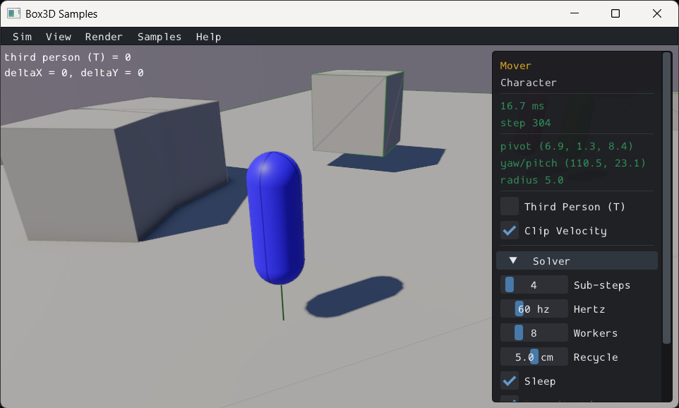

# Character Mover

> **Caution**: The character mover API is experimental.

Box3D provides a geometric character mover: a capsule that exists outside the
rigid body simulation and is driven entirely by application code. Because it is
not a simulated body, you have full control over movement without fighting the
solver, at the cost of having to resolve collisions yourself. This is the style
of mover common in first-person shooters and games with precise platforming.



## The Mover Capsule

The mover is represented by a `b3Capsule` in world space. A capsule is a good
shape for movement because its round profile slides smoothly along edges and
corners without snagging. Give the capsule a meaningful radius — a very thin
capsule behaves poorly with the encroachment handling described below.

```c
b3Capsule mover;
mover.center1 = (b3Vec3){ 0.0f, 0.35f, 0.0f };  // bottom sphere center
mover.center2 = (b3Vec3){ 0.0f, 1.45f, 0.0f };  // top sphere center
mover.radius  = 0.35f;
```

The mover has no explicit rotation handling. Slow rotation can be made to work
by updating the capsule each frame, but rapid spinning is not supported.

## Workflow

Each frame:

1. Compute a desired translation from input and physics (gravity, velocity).
2. Call `b3World_CastMover` to find how far the mover can actually travel.
3. Move the capsule by the returned fraction of the desired translation.
4. Call `b3World_CollideMover` to gather all contact planes at the new position.
5. Filter and assemble the planes into a `b3CollisionPlane` array.
6. Call `b3SolvePlanes` to compute a corrected position delta.
7. Apply the delta and call `b3ClipVector` to remove velocity components that
   push into surfaces.

## Swept Motion: b3World_CastMover

```c
float b3World_CastMover(
    b3WorldId           worldId,
    b3Pos               origin,   // world position the mover is relative to
    const b3Capsule*    mover,
    b3Vec3              translation,
    b3QueryFilter       filter,
    b3MoverFilterFcn*   fcn,      // optional, may be NULL
    void*               context
);
```

This casts the capsule through the world and returns the fraction `[0, 1]` of
`translation` that can be traveled before hitting something. Multiply the
translation by this fraction to get the safe displacement.

The cast handles *encroachment*: when the mover starts out touching a surface,
the inner line segment of the capsule may move slightly into that surface without
the full capsule generating an overlap. This lets the mover slide along walls
and floors it is already resting against without stopping dead at the first
frame.

The optional `b3MoverFilterFcn` callback lets you exclude specific shapes from
the cast (e.g., ignore triggers, teammates, or one-way platforms):

```c
typedef bool b3MoverFilterFcn(b3ShapeId shapeId, void* context);
// Return true to accept the shape, false to skip it.
```

`b3World_CastMover` is intended for movement, not for gathering contact
information. Use `b3World_CollideMover` for that.

## Contact Planes: b3World_CollideMover

```c
void b3World_CollideMover(
    b3WorldId           worldId,
    b3Pos               origin,   // mover and returned planes are relative to this
    const b3Capsule*    mover,
    b3QueryFilter       filter,
    b3PlaneResultFcn*   fcn,
    void*               context
);
```

This gathers all surfaces the mover is touching or overlapping and delivers them
via the callback:

```c
typedef bool b3PlaneResultFcn(
    b3ShapeId           shapeId,
    const b3PlaneResult* plane,
    int                 planeCount,
    void*               context
);
// Return true to continue gathering planes.
```

`b3PlaneResult` carries the contact plane and a world-space contact point:

```c
typedef struct b3PlaneResult {
    b3Plane plane;   // normal + offset: separation = dot(normal, p) - offset
    b3Vec3  point;
} b3PlaneResult;
```

The mover is treated as having fixed rotation, so only planes are needed — no
full contact manifolds.

### Per-Body Query: b3Body_CollideMover

When you need to test the mover against a single specific body (useful for
moving platforms or elevators):

```c
int b3Body_CollideMover(
    b3BodyId            bodyId,
    b3BodyPlaneResult*  bodyPlanes,
    int                 planeCapacity,
    b3Pos               origin,
    const b3Capsule*    mover,
    b3QueryFilter       filter,
    b3WorldTransform    bodyTransform
);
```

Returns the number of planes written into `bodyPlanes`. Each entry pairs the
originating `b3ShapeId` with a `b3PlaneResult`.

## Resolving Overlap: b3SolvePlanes

Convert the raw `b3PlaneResult` values from `b3World_CollideMover` into
`b3CollisionPlane` entries and call:

```c
typedef struct b3CollisionPlane {
    b3Plane plane;
    float   pushLimit;    // FLT_MAX for rigid; smaller values allow soft penetration
    float   push;         // output: how much the solver pushed along this plane
    bool    clipVelocity; // set true to clip velocity against this plane
} b3CollisionPlane;

b3PlaneSolverResult b3SolvePlanes(
    b3Vec3              targetDelta,
    b3CollisionPlane*   planes,
    int                 count
);
```

`b3SolvePlanes` finds the position delta closest to `targetDelta` that satisfies
all planes. The result contains the corrected `delta` and an `iterationCount`.

`pushLimit` controls softness. `FLT_MAX` gives a rigid surface. A smaller value
allows the mover to push through — useful for other players, enemies, or doors
that should yield but not fully block.

## Velocity Clipping: b3ClipVector

After resolving position, clip the mover's velocity so it does not keep
accelerating into blocked directions:

```c
b3Vec3 b3ClipVector(b3Vec3 vector, const b3CollisionPlane* planes, int count);
```

This removes the components of `vector` that push into any plane where
`clipVelocity` is true. Without this, velocity accumulates every frame the
mover is pressed against a surface.

## Putting It Together

```c
// The mover capsule and the planes are relative to origin. Keep origin near the
// character (its world position) so the query stays precise far from the world origin.
b3Pos origin = b3Pos_zero;

// 1. Desired translation from input + gravity integration
b3Vec3 translation = b3MulSV(timeStep, velocity);

// 2. Swept cast
float fraction = b3World_CastMover(worldId, origin, &mover, translation, filter, NULL, NULL);
b3Vec3 safeDelta = b3MulSV(fraction, translation);

// 3. Move the capsule
mover.center1 = b3Add(mover.center1, safeDelta);
mover.center2 = b3Add(mover.center2, safeDelta);

// 4. Gather contact planes
#define MAX_PLANES 16
b3CollisionPlane collisionPlanes[MAX_PLANES];
int planeCount = 0;

// (user callback stores planes into collisionPlanes / planeCount)
b3World_CollideMover(worldId, origin, &mover, filter, MyPlaneCallback, &planeCtx);

// 5. Solve planes
b3PlaneSolverResult result = b3SolvePlanes(b3Vec3_zero, collisionPlanes, planeCount);

// 6. Apply correction
mover.center1 = b3Add(mover.center1, result.delta);
mover.center2 = b3Add(mover.center2, result.delta);

// 7. Clip velocity
velocity = b3ClipVector(velocity, collisionPlanes, planeCount);
```

The `Mover` sample in the samples application shows a complete implementation
including acceleration, friction, jumping, and a pogo stick.
