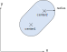
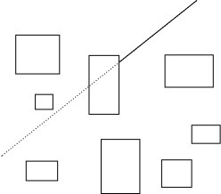
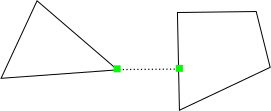
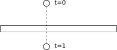
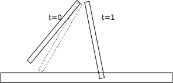
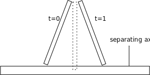
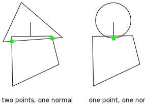
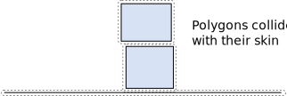
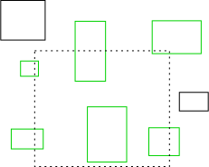

# Collision

Box3D provides geometric types and functions. These include:
- primitives: spheres, capsules, and convex hulls
- triangle meshes and height fields for static terrain
- convex hull construction from point clouds
- mass and bounding box computation
- local ray and shape casts
- contact manifolds
- shape distance (GJK)
- time of impact
- dynamic bounding volume tree

The collision interface is designed to be usable outside of rigid body simulation.
For example, you can use the dynamic tree for other aspects of your game besides physics.

The main purpose of Box3D is rigid body simulation, so the collision module only
contains features that are also useful in the physics engine.

## Shape Primitives

Shape primitives describe collision geometry and may be used independently of
physics simulation. At a minimum, you should understand how to create primitives
that can later be attached to rigid bodies.

Box3D shape primitives support several operations:
- Test a point or proxy for overlap with the primitive
- Perform a ray cast against the primitive
- Compute the primitive's bounding box
- Compute the mass properties of the primitive

### Spheres

Spheres have a center and radius. Spheres are solid.

<!-- TODO: 3D diagram needed -->

```c
b3Sphere sphere;
sphere.center = (b3Vec3){2.0f, 3.0f, 0.0f};
sphere.radius = 0.5f;
```

You can also initialize a sphere inline:

```c
b3Sphere sphere = {{2.0f, 3.0f, 0.0f}, 0.5f};
```

### Capsules

Capsules have two center points and a radius. The center points are the centers of two
hemispheres connected by a cylinder.



```c
b3Capsule capsule;
capsule.center1 = (b3Vec3){0.0f, -1.0f, 0.0f};
capsule.center2 = (b3Vec3){0.0f,  1.0f, 0.0f};
capsule.radius = 0.25f;
```

### Convex Hulls

Box3D convex hulls are solid convex polyhedra. The geometry lives in a heavy, immutable
`b3HullData` object. The world shares identical hull data through a reference counted
database, so many shapes built from the same data hold one copy. A shape is convex when
all line segments connecting two interior points remain inside the shape.

<!-- TODO: 3D diagram needed -->

The most common hull is a box. Use `b3MakeBoxHull` for an axis-aligned box and
`b3MakeCubeHull` for a cube. The values are half-extents (half-widths):

```c
b3BoxHull box = b3MakeBoxHull(0.5f, 1.0f, 0.5f);   // half-widths hx, hy, hz
b3BoxHull cube = b3MakeCubeHull(0.5f);              // uniform half-width
```

`b3BoxHull` stores everything inline — do not call `b3DestroyHull` on one.
Its `.base` member is the `b3HullData` that you pass to shape creation:

```c
b3CreateHullShape(bodyId, &shapeDef, &box.base);
```

For a box that is offset or rotated from the body origin:

```c
b3Transform localTransform = { offset, rotation };
b3BoxHull rotatedBox = b3MakeTransformedBoxHull(0.5f, 1.0f, 0.5f, localTransform);
```

For arbitrary convex geometry, provide a point cloud and let Box3D compute the hull:

```c
b3HullData* data = b3CreateHull(points, pointCount, maxVertexCount);
if (data == NULL)
{
    // degenerate input: coincident or coplanar points, or insufficient volume
}
b3CreateHullShape(bodyId, &shapeDef, data);
// The world keeps its own copy, so you may free yours immediately
b3DestroyHull(data);
```

`maxVertexCount` limits the output complexity; pass the same value as `pointCount`
to allow the full hull. `b3CreateHull` returns `NULL` on degenerate input (e.g. fewer
than four non-coplanar points, or nearly-zero volume). Always check before using it.

Box3D also provides helpers to create cylindrical and conical hulls:

```c
b3HullData* cylinder = b3CreateCylinder(height, radius, yOffset, sides);
b3HullData* cone     = b3CreateCone(height, radius1, radius2, slices);
b3DestroyHull(cylinder);
b3DestroyHull(cone);
```

Hulls created with `b3CreateCylinder`, `b3CreateCone`, and `b3CreateHull` are
heap-allocated and must be freed with `b3DestroyHull`. `b3BoxHull` values are
stack/struct-allocated and must not be freed.

### Triangle Meshes

Triangle meshes let you describe concave or open surfaces using a triangle soup.
They are intended for static geometry: `b3CreateMeshShape` only creates contacts
on static bodies.

The mesh is built from a `b3MeshDef` and cooked into a `b3MeshData` that contains
an internal BVH for efficient collision queries:

```c
b3MeshDef def = {0};
def.vertices      = myVerts;
def.vertexCount   = myVertCount;
def.indices       = myIndices;       // 3 per triangle
def.triangleCount = myTriCount;
def.weldVertices  = true;
def.identifyEdges = true;            // adjacency info for smooth inter-triangle normals

b3MeshData* mesh = b3CreateMesh(&def, NULL, 0);
```

Pass `identifyEdges = true` when triangles share edges so Box3D can suppress
internal-edge collisions between adjacent triangles (the 3D equivalent of ghost
collision handling on polygon chains).

The `b3Mesh` struct pairs a `b3MeshData` pointer with a scale vector:

```c
b3Mesh meshShape;
meshShape.data  = mesh;
meshShape.scale = (b3Vec3){1.0f, 1.0f, 1.0f};
```

Scale may be non-uniform and may have negative components, but no component may
be zero.

Per-triangle surface materials are supported. Provide a `b3SurfaceMaterial` array
in `b3ShapeDef::materials` and an index array in `b3MeshDef::materialIndices`:

```c
b3SurfaceMaterial materials[2] = { ... };
def.materialIndices = perTriangleMaterialIndex;  // uint8_t, 1 per triangle

b3ShapeDef shapeDef = b3DefaultShapeDef();
shapeDef.materials     = materials;
shapeDef.materialCount = 2;

b3ShapeId id = b3CreateMeshShape(bodyId, &shapeDef, mesh, scale);
```

Destroy the mesh data when no longer needed, after the shape referencing it has
been destroyed:

```c
b3DestroyMesh(mesh);
```

Box3D provides factory helpers for common mesh configurations:
`b3CreateGridMesh`, `b3CreateWaveMesh`, `b3CreateBoxMesh`, and others.

### Height Fields

Height fields describe terrain as a regular grid of sample heights. Like meshes,
they are only valid on static bodies.

```c
b3HeightFieldDef def = {0};
def.heights    = heightSamples;   // float[countX * countZ]
def.countX     = 256;
def.countZ     = 256;
def.scale      = (b3Vec3){1.0f, 1.0f, 1.0f};
def.globalMinimumHeight = -10.0f;
def.globalMaximumHeight =  50.0f;

b3HeightFieldData* hf = b3CreateHeightField(&def);
b3ShapeId id = b3CreateHeightFieldShape(bodyId, &shapeDef, hf);
```

`scale` controls cell spacing (x/z) and height scale (y). Setting a material index
to `B3_HEIGHT_FIELD_HOLE` (0xFF) punches a hole in that grid cell, useful for
cave entrances and tunnels.

When placing multiple height fields side by side, give all of them the same
`globalMinimumHeight` and `globalMaximumHeight` so compressed heights quantize
identically and the seams line up.

Destroy the height field after the shape referencing it has been destroyed:

```c
b3DestroyHeightField(hf);
```

### Compound Shapes

A compound shape aggregates spheres, capsules, hulls, and meshes into a single
static collision shape. Compounds are only allowed on static bodies. They are
designed for offline baking and open-world streaming — see the dedicated
[compound](compound.md) page for the full API and usage pattern.

## Geometric Queries

### Shape Point Test

Box3D does not expose standalone `b3PointInShape` functions. Point overlap is
expressed through the `b3ShapeProxy` abstraction that GJK uses. A degenerate
proxy — a single point with zero radius — serves as a point test:

```c
b3Vec3 queryPoint = {5.0f, 2.0f, 1.0f};
b3ShapeProxy proxy;
proxy.points = &queryPoint;
proxy.count  = 1;
proxy.radius = 0.0f;

b3Transform shapeTransform = b3Transform_identity;
bool hit = b3OverlapHull(&myHull, shapeTransform, &proxy);
```

The same pattern works with `b3OverlapSphere`, `b3OverlapCapsule`,
`b3OverlapMesh`, and `b3OverlapHeightField`.

### Ray Cast

Cast a ray at a shape to get the point of first intersection and the surface normal.

> **Caution**: No hit will register if the ray starts inside a convex shape such
> as a sphere or hull. Convex shapes are treated as solid.



```c
b3RayCastInput input = {0};
input.origin      = (b3Vec3){0.0f, 10.0f, 0.0f};
input.translation = (b3Vec3){0.0f, -20.0f, 0.0f};
input.maxFraction = 1.0f;

b3CastOutput output = b3RayCastHull(&myHull, &input);
if (output.hit)
{
    // output.point, output.normal, output.fraction
}
```

Per-shape ray cast functions: `b3RayCastSphere`, `b3RayCastCapsule`,
`b3RayCastHull`, `b3RayCastMesh`, `b3RayCastHeightField`, `b3RayCastCompound`.
All operate in the shape's local space. Use `b3IsValidRay` to validate input
before calling.

To cast against the full simulation world, use `b3World_CastRay` or the
convenience function `b3World_CastRayClosest`.

### Shape Cast

A shape cast sweeps an abstract point cloud (a `b3ShapeProxy`) through space and
finds where it first contacts another shape. A sphere is a single point with
a non-zero radius; a capsule is two points with a radius; a box is eight points
with zero radius.

```c
b3Vec3 proxyPoints[] = {{-0.5f, -0.5f, -0.5f}, {0.5f, 0.5f, 0.5f}};

b3ShapeCastInput input = {0};
input.proxy.points      = proxyPoints;
input.proxy.count       = 2;
input.proxy.radius      = 0.1f;
input.translation       = (b3Vec3){0.0f, -5.0f, 0.0f};
input.maxFraction       = 1.0f;

b3CastOutput output = b3ShapeCastHull(&myHull, &input);
if (output.hit)
{
    // output.point, output.normal, output.fraction
}
```

Per-shape cast functions: `b3ShapeCastSphere`, `b3ShapeCastCapsule`,
`b3ShapeCastHull`, `b3ShapeCastMesh`, `b3ShapeCastHeightField`,
`b3ShapeCastCompound`.

For the most general form — sweeping one proxy against another — use
`b3ShapeCast` with a `b3ShapeCastPairInput`. All shape cast functions call this
internally.

### Distance

`b3ShapeDistance` computes the closest points and separation distance between two
shapes, each expressed as a `b3ShapeProxy`. It uses the GJK algorithm.



```c
b3DistanceInput input = {0};
input.proxyA    = proxyA;       // b3ShapeProxy for shape A
input.proxyB    = proxyB;       // b3ShapeProxy for shape B
input.transform = b3InvMulWorldTransforms(worldA, worldB); // relative pose of B in A
input.useRadii  = true;

b3SimplexCache cache = b3_emptyDistanceCache;
b3DistanceOutput output = b3ShapeDistance(&input, &cache, NULL, 0);
// output.distance, output.pointA, output.pointB, output.normal are in shape A's frame
```

The query is origin independent and runs in frame A, so the witness points and
normal come back in shape A's frame. Lift them into world space with shape A's
transform if needed.

The simplex cache warm-starts the algorithm when shapes move by small amounts
between calls. On the first call zero-initialize the cache (or use
`b3_emptyDistanceCache`).

### Time of Impact

If two shapes move fast they may tunnel through each other in a single time step.



`b3TimeOfImpact` finds the earliest time at which two swept shapes touch. Box3D
uses this internally to prevent dynamic bodies from tunneling through static geometry.





The algorithm identifies an initial separating axis and advances the shapes along
it until they touch or pass each other. It may miss collisions that only become
apparent at the final positions, but those tend to be glancing contacts that rarely
matter in practice.

```c
b3TOIInput input = {0};
input.proxyA    = proxyA;
input.proxyB    = proxyB;
input.sweepA    = sweepA;   // b3Sweep: localCenter, c1, c2, q1, q2
input.sweepB    = sweepB;
input.maxFraction = 1.0f;

b3TOIOutput output = b3TimeOfImpact(&input);
if (output.state == b3_toiStateHit)
{
    // output.fraction is the time of impact in [0, maxFraction]
    // output.point and output.normal give the contact geometry
}
```

`b3Sweep` describes a rigid body's motion as a translation of the center of mass
plus a quaternion rotation, interpolated from `(c1, q1)` to `(c2, q2)`. Use
`b3GetSweepTransform` to evaluate the transform at any fraction.

### Contact Manifolds

Box3D computes contact points for overlapping shapes. In 3D, hull-hull contact
can produce up to `B3_MAX_MANIFOLD_POINTS` (4) points. All points share the same
contact normal so Box3D groups them into a manifold. The contact solver uses
this for stable stacking.



Normally you do not compute manifolds directly — you use the contact data
returned by the simulation. The `b3Manifold` struct contains:
- `normal`: unit normal from shape A toward shape B
- `points[B3_MAX_MANIFOLD_POINTS]`: contact points with separation, impulses,
  and feature ids
- `pointCount`: 0–4 valid points
- `frictionImpulse`, `twistImpulse`, `rollingImpulse`: accumulated friction state

For direct use, the low-level collide functions produce a `b3LocalManifold` in
the frame of shape A:

```c
b3LocalManifoldPoint points[B3_MAX_MANIFOLD_POINTS];
b3LocalManifold manifold;
manifold.points = points;

b3SATCache cache = {0};
b3CollideHulls(&manifold, B3_MAX_MANIFOLD_POINTS,
               &hullA, &hullB, transformBtoA, &cache);
```

Available collide functions:
- `b3CollideSpheres`
- `b3CollideCapsuleAndSphere`
- `b3CollideCapsules`
- `b3CollideHullAndSphere`
- `b3CollideHullAndCapsule`
- `b3CollideHulls`
- `b3CollideCapsuleAndTriangle`
- `b3CollideHullAndTriangle`
- `b3CollideSphereAndTriangle`

The SAT cache in `b3CollideHulls` warm-starts the separating axis search between
frames, the same idea as the simplex cache for GJK distance.

Box3D uses speculative collision: some contact points in a `b3Manifold` may
report a positive (separated) `separation`. Check `totalNormalImpulse` to
determine whether a speculative point actually had an interaction during the step.



## Dynamic Tree

`b3DynamicTree` organizes large numbers of AABBs into a hierarchical binary tree
for fast ray casts and region queries. Box3D uses it internally to manage the
broad phase, but it is also available for organizing spatial game data unrelated
to physics.

Each tree node stores a `b3AABB` and a 64-bit `userData` value. Internal nodes
have two children; leaf nodes are proxies you manage directly.

```c
// Create a tree with an initial proxy capacity
b3DynamicTree tree = b3DynamicTree_Create(256);

// Insert a proxy
b3AABB aabb = { lowerBound, upperBound };
int proxyId = b3DynamicTree_CreateProxy(&tree, aabb, categoryBits, userData);

// Move it
b3DynamicTree_MoveProxy(&tree, proxyId, newAabb);

// Remove it
b3DynamicTree_DestroyProxy(&tree, proxyId);

// Done
b3DynamicTree_Destroy(&tree);
```

**Category bits** allow broad-phase filtering without invoking the callback.
A proxy is only visited if `(maskBits & node->categoryBits) != 0` (or if
`requireAllBits` is set, the AND must equal `maskBits`).

### AABB Query

Find all proxies whose AABBs overlap a query box:

```c
b3TreeStats stats = b3DynamicTree_Query(
    &tree, queryAabb, maskBits, requireAllBits, myQueryCallback, context);
```

The callback receives `proxyId` and `userData` and returns `true` to continue.

### Closest Query

Find the proxy closest to a point:

```c
float minDistSqr = FLT_MAX;
b3TreeStats stats = b3DynamicTree_QueryClosest(
    &tree, point, maskBits, requireAllBits,
    myClosestCallback, context, &minDistSqr);
```

The callback receives the current minimum squared distance and returns the
squared distance to the user object inside the proxy, allowing the tree to
prune distant branches.

### Ray Cast

```c
b3TreeStats stats = b3DynamicTree_RayCast(
    &tree, &rayInput, maskBits, requireAllBits,
    myRayCastCallback, context);
```

The callback returns a new `maxFraction`. Return 0 to stop, a fraction less
than `input->maxFraction` to clip the ray (e.g. for closest-hit semantics),
or `input->maxFraction` to continue unclipped.

### Box Cast

```c
b3TreeStats stats = b3DynamicTree_BoxCast(
    &tree, &boxCastInput, maskBits, requireAllBits,
    myBoxCastCallback, context);
```

The tree sweeps the AABB in `boxCastInput`; the caller folds the cast shape's radius (and any
world origin) into that box. The callback then does the precise narrow-phase cast against each
leaf, taking only the advancing fraction from the tree.




`b3TreeStats` reports `nodeVisits` and `leafVisits` for performance profiling.
The tree can be rebuilt with `b3DynamicTree_Rebuild` to reclaim quality after
many insertions, and saved/loaded with `b3DynamicTree_Save` / `b3DynamicTree_Load`
for debugging.

Normally you will not use `b3DynamicTree` directly. For world-level ray casts and
overlap queries use `b3World_CastRay`, `b3World_OverlapAABB`, and
`b3World_OverlapShape`. See the `DynamicTree` sample for direct usage examples.
