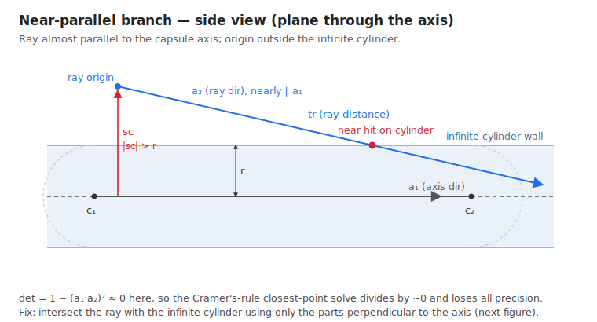
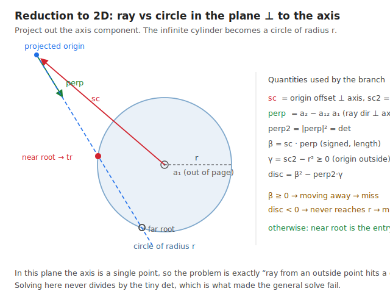
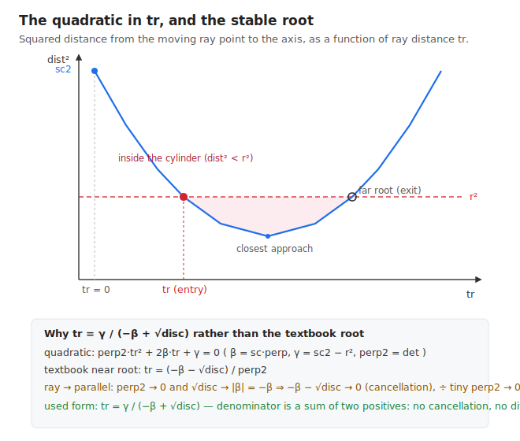

# Ray vs capsule: the near-parallel branch

This note explains the `det < FLT_EPSILON` block inside `b3RayCastCapsule`
(`src/capsule.c`). That block is the fallback used when the ray is almost parallel
to the capsule axis, where the normal closest-point solve falls apart numerically.

```c
float det = 1.0f - a12 * a12;
if ( det < FLT_EPSILON )
{
    // Ray nearly parallel to the capsule axis...
    b3Vec3 perp = b3MulSub( a2, a12, a1 );   // a2 - a12*a1
    float perp2 = b3LengthSquared( perp );

    float beta = b3Dot( sc, perp );
    float gamma = sc2 - r * r;

    float disc = beta * beta - perp2 * gamma;
    if ( beta >= 0.0f || disc < 0.0f )
    {
        return output;                       // miss
    }

    tr = gamma / ( -beta + sqrtf( disc ) );  // near intersection distance
}
```

---

## 1. What is already known when we reach this block

`b3RayCastCapsule` casts a ray against a capsule (a cylinder capped by two
hemispheres). By the time we reach line 232, several things are settled:

| symbol | meaning | code |
|---|---|---|
| `c1`, `c2` | the two capsule centers (ends of the core segment) | `shape->center1/2` |
| `r` | capsule radius | `shape->radius` |
| `axis` = `a1` | **unit** vector along the capsule axis, `c2 − c1` normalized | line 127 |
| `s` | ray origin relative to `c1` | line 123 |
| `u` | how far the origin projects along the axis, `dot(s, a1)` | line 130 |
| `sc` | the part of `s` **perpendicular** to the axis (axis → origin) | line 136 |
| `sc2` | `|sc|²`, squared distance from origin to the infinite axis | line 139 |
| `a2` = `rayAxis` | **unit** ray direction | line 177 |
| `a12` | `dot(a1, a2)`, the cosine of the angle between ray and axis | line 226 |

Two facts from the code above this branch matter a lot here:

- **The origin is outside the infinite cylinder.** The earlier `sc2 < r*r` test
  (line 142) already handled the inside case and returned. So here `sc2 ≥ r²`.
- **The ray has nonzero length** and was not rejected by the projected-extent early
  out (line 187).

`det = 1 − a12²`. Since `a12` is the cosine of the angle between the two unit axes,
`det = 1 − cos²θ = sin²θ`. It is the squared sine of the angle between the ray and
the capsule axis.

---

## 2. Why a special case at all

The general path (the `else` branch, lines 258–288) solves for the closest points
between the infinite ray and the infinite axis with Cramer's rule, dividing by
`det`:

```c
float invDet = 1.0f / det;
float t1 = ( sa1 - a12 * sa2 ) * invDet;
float t2 = ( a12 * sa1 - sa2 ) * invDet;
```

When the ray is nearly parallel to the axis, `θ → 0`, so `det = sin²θ → 0` and
`1/det → ∞`. Every quantity computed through `invDet` is multiplied by a huge,
rounding-amplified number. The "closest point on the axis" becomes meaningless, and
a ray that is slowly closing in on the capsule side can be missed entirely.

`FLT_EPSILON` (≈ 1.19e-7) is the cutoff, and the threshold is not arbitrary. `det`
is computed as `1 − a12*a12` with `a12 ≈ 1`, a subtraction of two nearly-equal
numbers. Its absolute rounding error is about one ulp of 1.0, i.e. `FLT_EPSILON`. So
once the true `det` shrinks to `~FLT_EPSILON`, the *computed* `det` has essentially no
correct bits left, and `1/det` (> 8 million here) faithfully amplifies that garbage.
Below the cutoff we branch to a method that **never forms `1/det`**.



---

## 3. The idea: collapse the axis and solve ray-vs-circle

When the ray is almost parallel to the axis, the interesting motion is not *along*
the axis, it is the slow drift *across* it. So drop the axis component entirely and
work in the 2D plane perpendicular to the axis.

In that plane:

- The infinite cylinder becomes a **circle of radius `r`**.
- The capsule axis collapses to a **single point** (the circle's center).
- The ray origin projects to a point at distance `√sc2 > r` (outside the circle).
- The ray's direction projects to the in-plane velocity `perp`.

The 3D "ray vs infinite cylinder" problem becomes the flat "ray from an outside
point hits a circle" problem, which has no `det` in it.



---

## 4. Line by line

### `perp = b3MulSub( a2, a12, a1 )` → `a2 − a12·a1`

This is the ray direction with its along-axis part removed: the component of `a2`
perpendicular to the axis. The comment notes you could also get a perpendicular
vector with a cross product, but subtracting the parallel part is cheaper and is
exactly the in-plane velocity we want. It is dimensionless (built from unit vectors).

A useful identity: because `a1` and `a2` are unit vectors,

```
|perp|² = |a2 − a12·a1|²
        = 1 − 2·a12² + a12²
        = 1 − a12²
        = det
```

So **`perp2` is mathematically the same tiny number as `det`.** That is fine — we
never *divide* by it in the end (see §6); it only appears multiplied into `disc`,
where being tiny does no harm.

### `perp2 = b3LengthSquared( perp )`

The squared length of that in-plane velocity. Equal to `det`, as just shown.

### `beta = b3Dot( sc, perp )`

Project the origin's perpendicular offset `sc` onto the in-plane velocity `perp`.
`sc` has length units and `perp` is dimensionless, so **`beta` carries length units.**

Its sign is what matters: `beta` is half the rate of change of the squared distance
to the axis at the start of the ray. `beta < 0` means the projected point is moving
**toward** the axis; `beta ≥ 0` means it is moving **away** (or tangent).

### `gamma = sc2 − r*r`

How far outside the cylinder the origin sits, in squared-length units. Because the
origin is outside, **`gamma ≥ 0`.**

### `disc = beta*beta − perp2*gamma`

The discriminant of the quadratic derived in §5. Sign units are length². If it is
negative, the (infinite) ray never gets within `r` of the axis.

### The early out: `if ( beta >= 0.0f || disc < 0.0f ) return`

Two distinct ways to miss:

- **`beta ≥ 0`** — the origin is already outside and the ray is heading away from the
  axis (or running tangent to it). It will never come back, so no side hit.
- **`disc < 0`** — the ray's closest approach to the axis is still more than `r` away.
  The infinite cylinder is never reached.

### `tr = gamma / ( -beta + sqrtf( disc ) )`

The distance along the ray (in length units, since `a2` is a unit vector) to the
**near** intersection with the infinite cylinder — where the ray first crosses into
the circle. The unusual algebraic form is deliberate; §6 explains it.

---

## 5. Where the quadratic comes from

Walk a point along the ray and ask when its perpendicular distance to the axis equals
`r`. Relative to `c1`, the ray point at distance `tr` is `s + tr·a2`. Its component
perpendicular to the axis is the sum of the perpendicular parts of each term:

```
perp_offset(tr) = sc + tr·perp
```

(`sc` is the perpendicular part of `s`; `perp` is the perpendicular part of `a2`.)
Set its squared length equal to `r²`:

```
|sc + tr·perp|² = r²
sc2 + 2·tr·(sc·perp) + tr²·|perp|² = r²
perp2·tr² + 2·beta·tr + gamma = 0          (gamma = sc2 − r²)
```

A plain quadratic `A·tr² + B·tr + C = 0` with `A = perp2`, `B = 2·beta`, `C = gamma`.
Its discriminant (over 4) is `beta² − perp2·gamma`, i.e. `disc`. The two roots are the
entry and exit distances of the ray through the infinite cylinder; we want the near
(entry) one.



---

## 6. Why the root is written `gamma / (−beta + √disc)`

The textbook near root of `perp2·tr² + 2·beta·tr + gamma = 0` is

```
tr = (−beta − √disc) / perp2
```

This is a trap exactly in the regime we are in:

- `perp2 = det` is tiny, so dividing by it amplifies error.
- As the ray approaches parallel, `perp2·gamma → 0`, so `disc → beta²` and
  `√disc → |beta|`. Since we already passed the `beta ≥ 0` test, here `beta < 0`, so
  `|beta| = −beta`. The numerator `−beta − √disc → −beta − (−beta) = 0`: a
  **catastrophic cancellation**. The expression collapses to `0 / 0`.

Multiply numerator and denominator by the conjugate `(−beta + √disc)` (equivalently,
use the product-of-roots identity `tr_near · tr_far = gamma / perp2`):

```
tr = gamma / (−beta + √disc)
```

Now the denominator is a **sum of two positive quantities** (`−beta > 0` and
`√disc ≥ 0`), so there is no cancellation, and `perp2` has vanished from the
expression — no division by the tiny determinant. Because `gamma ≥ 0` and the
denominator is `> 0`, the result satisfies `tr ≥ 0` automatically.

This mirrors the same trick used elsewhere in the file: `b3RayCastSphere` and the
`else` branch here both intersect relative to the closest point precisely to dodge
this kind of round-off.

**Limiting sanity check.** If the ray is *exactly* parallel (`a12 = 1`), then
`perp = a2 − a1 = 0`, so `perp2 = 0` and `beta = dot(sc, 0) = 0`. The `beta ≥ 0`
test fires and we return a miss — the correct answer, since a parallel ray that
starts outside the cylinder can only ever hit an endcap, never the side. The
division is never reached, so `perp2 = 0` is harmless.

---

## 7. Units recap

Everything stays dimensionally consistent, which is a quick way to sanity-check the
algebra:

| quantity | units |
|---|---|
| `perp`, `perp2`, `a12`, `det` | dimensionless |
| `beta = sc·perp` | length |
| `gamma = sc2 − r²` | length² |
| `disc = beta² − perp2·gamma` | length² |
| `tr = gamma / (−beta + √disc)` | length² / length = **length** |

`tr` is a true distance along the ray, not a fraction — the same convention the rest
of the function uses before the final `fraction` is formed.

---

## 8. What happens to `tr` afterward

Both branches (parallel and general) converge on the same tail code, which treats
`tr` as a candidate hit distance on the **infinite** cylinder and then decides what
the capsule actually does there:

1. **Range check** (line 291): reject if `tr < 0` or beyond the ray's max length.
2. **Map to the axis** (line 297): `tc = u + tr·a12` is where the hit projects along
   the axis, measured from `c1`.
3. **Endcap handoff**: if `tc < 0` the hit is past the `c1` end, so cast against the
   sphere at `c1`; if `tc > length`, cast against the sphere at `c2`. This is how the
   near-parallel case still reports endcap hits correctly.
4. **Side hit** (lines 324–333): otherwise the hit is genuinely on the cylindrical
   wall. Compute the point `c1 + s + tr·a2`, the outward normal (the point minus its
   projection onto the axis, normalized), and the fraction.

So this whole block has one job: produce a numerically trustworthy `tr` for the
cylinder intersection when the ray is nearly parallel. The shared tail does the rest.

---

## Figures

The three SVGs referenced above live in `docs/images/`:

- `rc_parallel_setup.svg` — side view: why the parallel case is hard.
- `rc_parallel_crosssection.svg` — the 2D reduction to ray-vs-circle.
- `rc_parallel_quadratic.svg` — the quadratic, its roots, and the cancellation fix.
