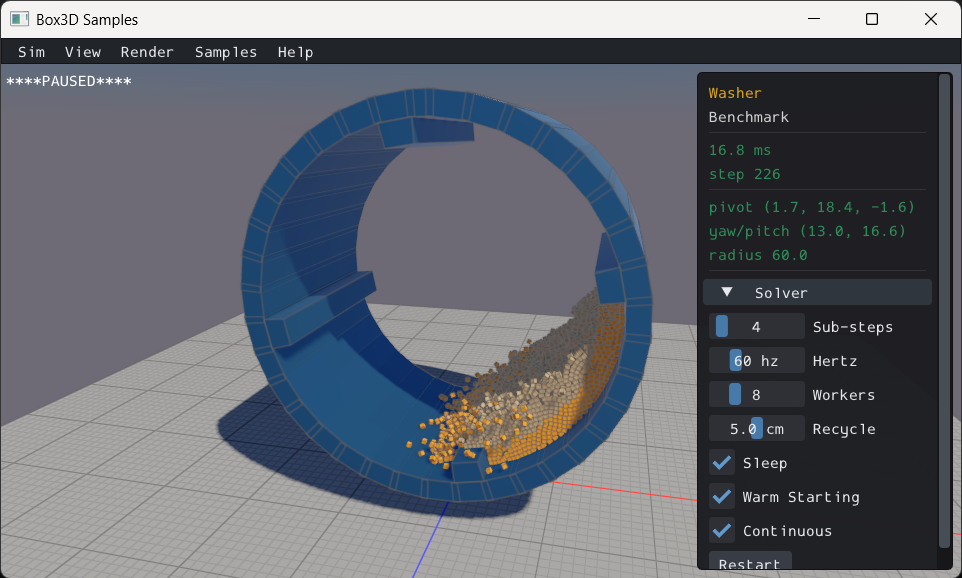

# Samples {#samples}
Once you have conquered the HelloWorld example, you should start looking
at Box3D's samples application. The samples application is a testing framework and demo
environment. Here are some of the features:
- Camera with pan and zoom
- Mouse dragging of dynamic bodies
- Many samples in a tree view
- GUI for selecting samples, parameter tuning, and debug drawing options
- Pause and single step simulation
- Multithreading and performance data

The samples application has many examples of Box3D usage in the test cases and the
framework itself. I encourage you to explore and tinker with the samples
as you learn Box3D.

Note: the sample application is written using [GLFW](https://www.glfw.org) and
[imgui](https://github.com/ocornut/imgui).
The samples app is not part of the Box3D library. The Box3D library is agnostic about rendering.
As shown by the HelloWorld example, you don't need a renderer to use Box3D.
