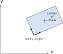
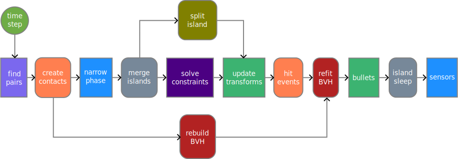

# Simulation
Rigid body simulation is the primary feature of Box3D. It is the most complex part of
Box3D and is the part you will likely interact with the most. Simulation sits on top of
the foundation and collision layers, so you should be somewhat familiar with those by now.

Rigid body simulation contains:
- worlds
- bodies
- shapes
- contacts
- joints
- events

There are many dependencies between these objects so it is difficult to
describe one without referring to another. In the following, you
may see some references to objects that have not been described yet.
Therefore, you may want to quickly skim this section before reading it
closely.

## Ids
Box3D has a C interface. Typically in a C/C++ library when you create an object with a long lifetime
you will keep a pointer (or smart pointer) to the object.

Box3D works differently. Instead of pointers, you are given an *id* when you create an object.
This *id* acts as a [handle](https://en.wikipedia.org/wiki/Handle_(computing)) which helps avoid
problems with [dangling pointers](https://en.wikipedia.org/wiki/Dangling_pointer).

This also allows Box3D to use [data-oriented design](https://en.wikipedia.org/wiki/Data-oriented_design) internally.
This helps to reduce cache misses drastically and also allows for [SIMD](https://en.wikipedia.org/wiki/Single_instruction,_multiple_data) optimizations.

So you will be dealing with `b3WorldId`, `b3BodyId`, etc. These are small opaque structures that you
will pass around by value, just like pointers. Box3D creation functions return an id. Functions
that operate on Box3D objects take ids.

```c
b3BodyId myBodyId = b3CreateBody(myWorldId, &myBodyDef);
```

There are functions to check if an id is valid. Box3D functions will assert if you use an invalid id.
This makes debugging easier than using dangling pointers.

```c
if (b3Body_IsValid(myBodyId) == false)
{
    // oops
}
```

Null ids can be established in a couple of ways. You can use predefined constants or zero initialization.
```c
b3BodyId myNullBodyId = b3_nullBodyId;
b3BodyId otherNullBodyId = {0};
```

You can test if an id is null using some helper macros:
```c
if (B3_IS_NULL(myBodyId))
{
    // do something
}
```

```c
if (B3_IS_NON_NULL(myShapeId))
{
    // do something
}
```

## World
The Box3D world contains the bodies and joints. It manages all aspects
of the simulation and allows for asynchronous queries (like AABB queries
and ray-casts). Much of your interactions with Box3D will be with a
world object, using `b3WorldId`.

### World Definition
Worlds are created using a *definition* structure. This is a temporary structure that
you can use to configure options for world creation. You **must** initialize the world definition
using `b3DefaultWorldDef()`.

```c
b3WorldDef worldDef = b3DefaultWorldDef();
```

The world definition has lots of options, but for most you will use the defaults. You may want to set the gravity:

```c
// +Y is up; default is {0, -10, 0}
worldDef.gravity = (b3Vec3){0.0f, -10.0f, 0.0f};
```

Box3D has no built-in concept of an up direction. Gravity is simply a `b3Vec3` applied to every
dynamic body each step.

If your game doesn't need sleep, you can get a performance boost by completely disabling sleep:

```c
worldDef.enableSleep = false;
```

You can also configure multithreading to improve performance:

```c
worldDef.workerCount = 4;
worldDef.enqueueTask = myAddTaskFunction;
worldDef.finishTask = myFinishTaskFunction;
worldDef.userTaskContext = &myTaskSystem;
```

Multithreading is not required but it can improve performance substantially.

### World Lifetime
Creating a world is done using a world definition.

```c
b3WorldId myWorldId = b3CreateWorld(&worldDef);

// ... do stuff ...

b3DestroyWorld(myWorldId);

// Nullify id for safety
myWorldId = b3_nullWorldId;
```

You can create up to 128 worlds. These worlds do not interact and may be simulated in parallel.

When you destroy a world, every body, shape, and joint is also destroyed. This is much faster
than destroying individual objects.

### Simulation
The world is used to drive the simulation. You specify a time step
and a sub-step count. For example:

```c
float timeStep = 1.0f / 60.0f;
int subStepCount = 4;
b3World_Step(myWorldId, timeStep, subStepCount);
```

After the time step you can examine your bodies and joints for
information. Most likely you will grab the position off the bodies so
that you can update your game objects and render them. Or more optimally, you
will use `b3World_GetBodyEvents()`.

You can perform the time step anywhere in your game loop, but you should be aware of the
order of things. For example, you must create bodies before the time
step if you want to get collision results for the new bodies in that
frame.

You should use a fixed time step. By using a larger time step you can improve performance in
low frame rate scenarios. But generally you should use a time step of 1/30 seconds (30Hz) or smaller.
A time step of 1/60 seconds (60Hz) will usually deliver a high quality simulation.

The sub-step count is used to increase accuracy. By sub-stepping the solver
divides up time into small increments and the bodies move by a small amount.
This allows joints and contacts to respond with finer detail. The recommended
sub-step count is 4. However, increasing the sub-step count may improve
accuracy. For example, long joint chains will stretch less with more sub-steps.

## Rigid Bodies
Rigid bodies, or just *bodies*, have position and velocity. You can apply forces, torques,
and impulses to bodies. Bodies can be static, kinematic, or dynamic.

A 3D rigid body has 6 degrees of freedom: 3 translational (position along x, y, z) and
3 rotational (rotation about x, y, z axes). Orientation is represented as a quaternion
(`b3Quat`), and angular velocity and torque are both `b3Vec3` quantities.

Here are the body type definitions:

### Body Types
`b3_staticBody`:
A static body does not move under simulation and behaves as if it has infinite mass.
Internally, Box3D stores zero for the mass and the inverse mass. A static body has zero
velocity. Static bodies do not collide with other static or kinematic bodies.

`b3_kinematicBody`:
A kinematic body moves under simulation according to its velocity.
Kinematic bodies do not respond to forces. A kinematic body is moved by setting its
velocity. A kinematic body behaves as if it has infinite mass, however,
Box3D stores zero for the mass and the inverse mass. Kinematic bodies do
not collide with other kinematic or static bodies. Generally you should use
a kinematic body if you want a shape to be animated and not affected by
forces or collisions.

`b3_dynamicBody`:
A dynamic body is fully simulated and moves according to forces and torques.
A dynamic body can collide with all body types. A dynamic body always has
finite, non-zero mass.

> **Caution**:
> Generally you should not set the transform on bodies after creation.
> Box3D treats this as a teleport and may result in undesirable behavior and/or performance problems.

Bodies carry shapes and move them around in the world. Bodies are always
rigid bodies in Box3D. That means two shapes attached to the same rigid body never move
relative to each other, and shapes attached to the same body don't collide.

Shapes have collision geometry and density. Normally, bodies acquire
their mass properties from the shapes. However, you can override the
mass properties after a body is constructed.

You usually keep ids to all the bodies you create. This way you can
query the body positions to update the positions of your graphical
entities. You should also keep body ids so you can destroy them
when you are done with them.

### Body Definition
Before a body is created you must create a body definition (`b3BodyDef`).
The body definition holds the data needed to create and initialize a
body correctly.

Because Box3D uses a C API, a function is provided to create a default
body definition.

```c
b3BodyDef myBodyDef = b3DefaultBodyDef();
```

This ensures the body definition is valid and this initialization is **mandatory**.

Box3D copies the data out of the body definition; it does not keep a
pointer to the body definition. This means you can recycle a body
definition to create multiple bodies.

### Body Type
As discussed previously, there are three different
body types: static, kinematic, and dynamic. `b3_staticBody` is the default.
You should establish the body type at creation because changing the body type
later is expensive.

```c
b3BodyDef bodyDef = b3DefaultBodyDef();
bodyDef.type = b3_dynamicBody;
```

### Position and Orientation
You can initialize the body position and orientation in the body definition. This has far
better performance than creating the body at the world origin and then moving the body.

> **Caution**:
> Do not create a body at the origin and then move it. If you create
> several bodies at the origin, then performance will suffer.

A body has two main points of interest. The first point is the body's
origin. Shapes and joints are attached relative to the body's origin.
The second point of interest is the center of mass. The center of mass
is determined from the mass distribution of the attached shapes or is
explicitly set using `b3MassData`. Much of Box3D's internal computations
use the center of mass position. For example the body stores the linear
velocity for the center of mass, not the body origin.



When you are building the body definition, you may not know where the
center of mass is located. Therefore you specify the position of the
body's origin. You may also specify the body's orientation as a `b3Quat`.
If you later change the mass properties of the body, then the center of mass may move
on the body, but the origin position and orientation do not change and the attached
shapes and joints do not move.

```c
b3BodyDef bodyDef = b3DefaultBodyDef();
bodyDef.position = (b3Vec3){0.0f, 2.0f, 0.0f};

// Rotate 45 degrees about the Y axis
b3Vec3 axis = {0.0f, 1.0f, 0.0f};
bodyDef.rotation = b3MakeQuatFromAxisAngle(axis, 0.25f * B3_PI);
```

To read the axis and angle back from a quaternion:

```c
b3Quat q = b3Body_GetRotation(myBodyId);
float radians;
b3Vec3 axis = b3GetAxisAngle(&radians, q);
```

A rigid body is a frame of reference. You can define shapes and
joints in that frame. Those shapes and joint anchors never move in the
local frame of the body.

### Damping
Damping is used to reduce the world velocity of bodies. Damping is
different than friction because friction only occurs with contact.
Damping is not a replacement for friction and the two effects are
used together.

Damping parameters are non-negative. Normally you will use a
damping value between 0 and 1. Linear damping is generally undesirable
because it makes bodies look like they are floating.

```c
bodyDef.linearDamping = 0.0f;
bodyDef.angularDamping = 0.1f;
```

Damping is approximated to improve performance. At small damping
values the damping effect is mostly independent of the time step. At
larger damping values, the damping effect will vary with the time step.
This is not an issue if you use a fixed time step (recommended).

### Gravity Scale
You can use the gravity scale to adjust the gravity on a single body. Be
careful though, a large gravity magnitude can decrease stability.

```c
// Set the gravity scale to zero so this body will float
bodyDef.gravityScale = 0.0f;
```

### Sleep Parameters
When a body comes to rest, Box3D can stop simulating it to save CPU time.
This is called *sleeping*. When Box3D determines that a body (or group of bodies)
has come to rest, the body enters a sleep state which has very little CPU overhead.
If a body is awake and collides with a sleeping body, then the sleeping body
wakes up. Bodies will also wake up if a joint or contact attached to
them is destroyed. You can also wake a body manually.

The body definition lets you specify whether a body can sleep and
whether a body is created sleeping.

```c
bodyDef.enableSleep = true;
bodyDef.isAwake = true;
```

The `isAwake` flag is ignored if `enableSleep` is false.

### Motion Locks
In 3D you sometimes want to restrict a body to a subset of its six degrees of freedom.
For example, you might want a door hinge that only rotates about the Y axis, or a
platform that only translates along X. Box3D provides `b3MotionLocks` for this:

```c
b3MotionLocks locks = {0};
locks.linearY  = true;   // prevent translation along Y
locks.angularX = true;   // prevent rotation about X
locks.angularZ = true;   // prevent rotation about Z
bodyDef.motionLocks = locks;
```

You can also update locks after creation:

```c
b3Body_SetMotionLocks(myBodyId, locks);
b3MotionLocks current = b3Body_GetMotionLocks(myBodyId);
```

Locking all three angular axes is equivalent to fixing the rotation entirely.

### Bullets {#bullets}
Game simulation usually generates a sequence of transforms that are played
at some frame rate. This is called discrete simulation. In discrete
simulation, rigid bodies can move by a large amount in one time step. If
a physics engine doesn't account for the large motion, you may see some
objects incorrectly pass through each other. This effect is called
*tunneling*.


By default, Box3D uses continuous collision detection (CCD) to prevent
dynamic bodies from tunneling through static bodies. This is done by
sweeping shapes from their old position to their new positions. The
engine looks for new collisions during the sweep and computes the time
of impact (TOI) for these collisions. Bodies are moved to their first
TOI at the end of the time step.


Normally CCD is not used between dynamic bodies. This is done to keep
performance reasonable. In some game scenarios you need dynamic bodies
to use CCD. For example, you may want to shoot a high speed bullet at a
stack of dynamic bricks. Without CCD, the bullet might tunnel through
the bricks.

Fast moving objects in Box3D can be configured as *bullets*. Bullets will
perform CCD with all body types, but **not** other bullets. You should decide what
bodies should be bullets based on your game design. If you decide a body
should be treated as a bullet, use the following setting.

```c
bodyDef.isBullet = true;
```

The bullet flag only affects dynamic bodies. Bullets should be used sparingly.

### Disabling
You may wish a body to be created but not participate in collision or
simulation. This state is similar to sleeping except the body will not be
woken by other bodies and the body's shapes will not collide with anything.
This means the body will not participate in collisions, ray
casts, etc.

You can create a body as disabled and later enable it.

```c
bodyDef.isEnabled = false;

// Later ...
b3Body_Enable(myBodyId);
```

Joints may be connected to disabled bodies. These joints will not be
simulated. You should be careful when you enable a body that its
joints are not distorted.

Note that enabling a body is almost as expensive as creating the body
from scratch. So you should not use body disabling for streaming worlds. Instead, use
creation/destruction for streaming worlds to save memory.

### User Data
User data is a void pointer. This gives you a hook to link your
application objects to bodies. You should be consistent to use the same
object type for all body user data.

```c
bodyDef.userData = &myGameObject;
```

This is useful when you receive results from a query such as a ray-cast
or event and you want to get back to your game object. You can acquire the
user data from a body using `b3Body_GetUserData()`.

### Body Lifetime
Bodies are created and destroyed using a world id. This lets the world create
the body with an efficient allocator and add the body to the world data structure.

```c
b3BodyId myBodyId = b3CreateBody(myWorldId, &bodyDef);

// ... do stuff ...

b3DestroyBody(myBodyId);

// Nullify body id for safety
myBodyId = b3_nullBodyId;
```

Box3D does not keep a reference to the body definition or any of the
data it holds (except user data pointers). So you can create temporary
body definitions and reuse the same body definitions.

Box3D allows you to avoid destroying bodies by destroying the world
directly using `b3DestroyWorld()`, which does all the cleanup work for you.
However, you should be mindful to nullify body ids that you keep in your application.

When you destroy a body, the attached shapes and joints are
automatically destroyed. This has important implications for how you
manage shape and joint ids. You should nullify these ids after destroying
a body.

### Using a Body
After creating a body, there are many operations you can perform on the
body. These include setting mass properties, accessing position and
velocity, applying forces, and transforming points and vectors.

### Mass Data
A body has mass (scalar), center of mass (`b3Vec3`), and a rotational
inertia tensor (`b3Matrix3`). For static bodies, the mass and rotational inertia are
set to zero. When all angular motion locks are active, the rotational inertia is
effectively zero.

Normally the mass properties of a body are established automatically
when shapes are added to the body. You can also adjust the mass of a
body at run-time. This is usually done when you have special game
scenarios that require altering the mass.

```c
b3MassData myMassData;
myMassData.mass = 10.0f;
myMassData.center = (b3Vec3){0.0f, 0.0f, 0.0f};
myMassData.inertia = b3Mat3_identity; // b3Matrix3 inertia tensor
b3Body_SetMassData(myBodyId, myMassData);
```

After setting a body's mass directly, you may wish to revert to the
mass determined by the shapes. You can do this with:

```c
b3Body_ApplyMassFromShapes(myBodyId);
```

The body's mass data is available through the following functions:

```c
float mass = b3Body_GetMass(myBodyId);
b3Matrix3 inertia = b3Body_GetLocalRotationalInertia(myBodyId);
b3Vec3 localCenter = b3Body_GetLocalCenter(myBodyId);
b3MassData massData = b3Body_GetMassData(myBodyId);
```

### State Information

There are many aspects to the body's state. You can access this state
data through the following functions:

```c
b3Body_SetType(myBodyId, b3_kinematicBody);
b3BodyType bodyType = b3Body_GetType(myBodyId);
b3Body_SetBullet(myBodyId, true);
bool isBullet = b3Body_IsBullet(myBodyId);
b3Body_EnableSleep(myBodyId, false);
bool isSleepEnabled = b3Body_IsSleepEnabled(myBodyId);
b3Body_SetAwake(myBodyId, true);
bool isAwake = b3Body_IsAwake(myBodyId);
b3Body_Disable(myBodyId);
b3Body_Enable(myBodyId);
bool isEnabled = b3Body_IsEnabled(myBodyId);
b3Body_SetMotionLocks(myBodyId, locks);
b3MotionLocks locks = b3Body_GetMotionLocks(myBodyId);
```

Please see the comments on these functions for more details.

### Position and Velocity
You can access the position and orientation of a body. This is common when
rendering your associated game object. You can also set the position and orientation,
although this is less common since you will normally use Box3D to
simulate movement.

```c
b3Body_SetTransform(myBodyId, position, rotation);
b3Transform transform = b3Body_GetTransform(myBodyId);
b3Vec3 position = b3Body_GetPosition(myBodyId);
b3Quat rotation = b3Body_GetRotation(myBodyId);
```

You can access the center of mass position in local and world
coordinates. Much of the internal simulation in Box3D uses the center of
mass. However, you should normally not need to access it. Instead you
will usually work with the body transform. For example, you may have a
body that is a box. The body origin might be a corner of the box,
while the center of mass is located at the center of the box.

```c
b3Pos worldCenter = b3Body_GetWorldCenter(myBodyId);
b3Vec3 localCenter = b3Body_GetLocalCenter(myBodyId);
```

You can access the linear and angular velocity. The linear velocity is
for the center of mass. The angular velocity is a `b3Vec3` whose direction
is the axis of rotation and whose magnitude is the rotation rate in radians per second.

```c
b3Vec3 linearVelocity = b3Body_GetLinearVelocity(myBodyId);
b3Vec3 angularVelocity = b3Body_GetAngularVelocity(myBodyId);
```

You can drive a body to a specific transform. This is useful for kinematic bodies.

```c
b3Pos targetPosition = {42.0f, 0.0f, -100.0f};
b3Quat targetRotation = b3MakeQuatFromAxisAngle(b3Vec3_axisY, B3_PI);
b3WorldTransform target = {targetPosition, targetRotation};
float timeStep = 1.0f / 60.0f;
b3Body_SetTargetTransform(myBodyId, target, timeStep, true);
```

### Forces and Impulses
You can apply forces, torques, and impulses to a body. When you apply a
force or an impulse, you can provide a world point where the load is
applied. This often results in a torque about the center of mass.

```c
b3Body_ApplyForce(myBodyId, force, worldPoint, wake);
b3Body_ApplyTorque(myBodyId, torque, wake);
b3Body_ApplyLinearImpulse(myBodyId, linearImpulse, worldPoint, wake);
b3Body_ApplyAngularImpulse(myBodyId, angularImpulse, wake);
```

All force, torque, and impulse values are `b3Vec3` in world space. Applying a
force, torque, or impulse optionally wakes the body. If you don't
wake the body and it is asleep, then the force or impulse will be ignored.

You can also apply a force and linear impulse to the center of mass to avoid rotation.

```c
b3Body_ApplyForceToCenter(myBodyId, force, wake);
b3Body_ApplyLinearImpulseToCenter(myBodyId, linearImpulse, wake);
```

> **Caution**:
> Since Box3D uses sub-stepping, you should not apply a steady impulse
> for several frames. Instead you should apply a force which Box3D will
> spread out evenly across the sub-steps, resulting in smoother movement.

### Coordinate Transformations
The body has some utility functions to help you transform points
and vectors between local and world space. If you don't understand
these concepts, I recommend reading "Essential Mathematics for Games and
Interactive Applications" by Jim Van Verth and Lars Bishop.

```c
b3Vec3 worldPoint = b3Body_GetWorldPoint(myBodyId, localPoint);
b3Vec3 worldVector = b3Body_GetWorldVector(myBodyId, localVector);
b3Vec3 localPoint = b3Body_GetLocalPoint(myBodyId, worldPoint);
b3Vec3 localVector = b3Body_GetLocalVector(myBodyId, worldVector);
```

### Accessing Shapes and Joints
You can access the shapes on a body. You can get the number of shapes first.

```c
int shapeCount = b3Body_GetShapeCount(myBodyId);
```

If you have bodies with many shapes, you can allocate an array or if you
know the number is limited you can use a fixed size array.

```c
b3ShapeId shapeIds[10];
int returnCount = b3Body_GetShapes(myBodyId, shapeIds, 10);

for (int i = 0; i < returnCount; ++i)
{
    b3ShapeId shapeId = shapeIds[i];

    // do something with shapeId
}
```

You can similarly get an array of the joints on a body.

### Body Events
While you can gather transforms from all your bodies after every time step, this is inefficient.
Many bodies may not have moved because they are sleeping. Also iterating across many bodies
will have lots of cache misses.

Box3D provides `b3BodyEvents` that you can access after every call to `b3World_Step()` to get
an array of body movement events. Since this data is contiguous, it is cache friendly.

```c
b3BodyEvents events = b3World_GetBodyEvents(myWorldId);
for (int i = 0; i < events.moveCount; ++i)
{
    const b3BodyMoveEvent* event = events.moveEvents + i;
    MyGameObject* gameObject = event->userData;
    MoveGameObject(gameObject, event->transform);
    if (event->fellAsleep)
    {
        SleepGameObject(gameObject);
    }
}
```

The body event also indicates if the body fell asleep this time step. This might be useful to
optimize your application.

## Shapes
A body may have zero or more shapes. A body with multiple shapes is sometimes
called a *compound body.*

Shapes hold the following:
- a shape primitive
- density, friction, and restitution (via `baseMaterial`)
- collision filtering flags
- parent body id
- user data
- sensor flag

These are described in the following sections.

The geometry types (sphere, capsule, hull, mesh, height field) are documented in detail in
`collision.md`. Compound shapes are documented in `compound.md`. This section covers the
shape lifecycle and material properties.

### Shape Lifetime
Shapes are created by initializing a shape definition and a shape primitive.
These are passed to a creation function specific to each shape type.

```c
b3ShapeDef shapeDef = b3DefaultShapeDef();
shapeDef.density = 10.0f;
shapeDef.baseMaterial.friction = 0.7f;

b3BoxHull box = b3MakeBoxHull(0.5f, 0.5f, 1.0f);
b3ShapeId myShapeId = b3CreateHullShape(myBodyId, &shapeDef, &box.base);
```

This creates a hull shape and attaches it to the body. You do not need to
store the shape id since the shape will automatically be
destroyed when the parent body is destroyed. However, you may wish to store the shape id if you plan
to change properties on it later.

You can create multiple shapes on a single body. They all can contribute
to the mass of the body. These shapes never collide with each other and may overlap.

You can destroy a shape on the parent body. You may do this to model a
breakable object. Otherwise you can just leave the shape alone and let
the body destruction take care of destroying the attached shapes.

```c
b3DestroyShape(myShapeId, true);
```

The second argument controls whether the parent body's mass is updated immediately.

Material properties such as density, friction, and restitution are associated with shapes
instead of bodies. Since you can attach multiple shapes to a body, this allows for more
possible setups. For example, you can make a vehicle that is heavier in the back.

### Density

The shape density is used to compute the mass properties of the parent
body. The density can be zero or positive. You should generally use
similar densities for all your shapes. This will improve stacking
stability.

You may adjust the density of an existing body. You may choose to update the body mass immediately
or defer for a later call to `b3Body_ApplyMassFromShapes()`. Generally you should establish
the shape density in `b3ShapeDef` and avoid modifying it later because this can be expensive,
especially on a body with many shapes.

```c
bool updateMass = false;
b3Shape_SetDensity(myShapeId, 5.0f, updateMass);
b3Body_ApplyMassFromShapes(myBodyId);
```

### Friction

Friction is used to make objects slide along each other realistically.
Box3D supports static and dynamic friction, but uses the same parameter
for both. Box3D attempts to simulate friction accurately and the friction
strength is proportional to the normal force. This is called [Coulomb
friction](https://en.wikipedia.org/wiki/Friction). The friction parameter
is usually set between 0 and 1, but
can be any non-negative value. A friction value of 0 turns off friction
and a value of 1 makes the friction strong. When the friction force is
computed between two shapes, Box3D must combine the friction parameters
of the two parent shapes. This is done with the
[geometric mean](https://en.wikipedia.org/wiki/Geometric_mean):

```c
float mixedFriction = sqrtf(b3Shape_GetFriction(shapeIdA) * b3Shape_GetFriction(shapeIdB));
```

If one shape has zero friction then the mixed friction will be zero.

Friction is stored as part of the shape's base surface material:

```c
shapeDef.baseMaterial.friction = 0.5f;
```

### Restitution

[Restitution](https://en.wikipedia.org/wiki/Coefficient_of_restitution) is used to make
objects bounce. The restitution value is
usually set to be between 0 and 1. Consider dropping a ball on a table.
A value of zero means the ball won't bounce. This is called an
*inelastic* collision. A value of one means the ball's velocity will be
exactly reflected. This is called a *perfectly elastic* collision.
Restitution is combined using the following formula.

```c
float mixedRestitution = b3MaxFloat(b3Shape_GetRestitution(shapeIdA), b3Shape_GetRestitution(shapeIdB));
```

Restitution is combined this way so that you can have a bouncy super
ball without having a bouncy floor.

When a shape develops multiple contacts, restitution is simulated
approximately. This is because Box3D uses a sequential solver. Box3D
also uses inelastic collisions when the collision velocity is small.
This is done to prevent jitter. See `b3WorldDef::restitutionThreshold`.

Restitution is stored as part of the shape's base surface material:

```c
shapeDef.baseMaterial.restitution = 0.3f;
```

### Friction and Restitution Callbacks

Advanced users can override friction and restitution mixing using `b3FrictionCallback`
and `b3RestitutionCallback`. These should be very lightweight functions because they
are called frequently. The callbacks receive the two friction (or restitution) values
and the user material ids from each shape's surface material.

```c
float MyFrictionCallback(float frictionA, uint64_t userMaterialIdA,
                         float frictionB, uint64_t userMaterialIdB)
{
    if (userMaterialIdA > userMaterialIdB)
    {
        return frictionA;
    }

    return frictionB;
}

b3WorldDef worldDef = b3DefaultWorldDef();
worldDef.frictionCallback = MyFrictionCallback;
```

### Filtering {#filtering}

Collision filtering allows you to efficiently prevent collision between shapes.
For example, say you make a character that rides a bicycle. You want the
bicycle to collide with the terrain and the character to collide with
the terrain, but you don't want the character to collide with the
bicycle (because they must overlap). Box3D supports such collision
filtering using categories, masks, and groups.

Box3D supports 64 collision categories (stored as `uint64_t`). For each shape you can specify
which category it belongs to. You can also specify what other categories
this shape can collide with. For example, you could specify in a
multiplayer game that players don't collide with each other. Rather
than identifying all the situations where things should not collide, I recommend
identifying all the situations where things should collide. This way you
don't get into situations where you are using
[double negatives](https://en.wikipedia.org/wiki/Double_negative).
You can specify which things can collide using mask bits. For example:

```c
enum MyCategories
{
    PLAYER  = 0x00000002,
    MONSTER = 0x00000004,
};

b3ShapeDef playerShapeDef  = b3DefaultShapeDef();
b3ShapeDef monsterShapeDef = b3DefaultShapeDef();
playerShapeDef.filter.categoryBits  = PLAYER;
monsterShapeDef.filter.categoryBits = MONSTER;

// Players collide with monsters, but not with other players
playerShapeDef.filter.maskBits = MONSTER;

// Monsters collide with players and other monsters
monsterShapeDef.filter.maskBits = PLAYER | MONSTER;
```

Here is the rule for a collision to occur:

```c
uint64_t catA  = shapeA.filter.categoryBits;
uint64_t maskA = shapeA.filter.maskBits;
uint64_t catB  = shapeB.filter.categoryBits;
uint64_t maskB = shapeB.filter.maskBits;

if ((catA & maskB) != 0 && (catB & maskA) != 0)
{
    // shapes can collide
}
```

Another filtering feature is *collision groups*.
Collision groups let you specify a group index. You can have
all shapes with the same group index always collide (positive index)
or never collide (negative index). Group indices are usually used for
things that are somehow related, like the parts of a vehicle. In the
following example, shape1 and shape2 always collide, but shape3
and shape4 never collide.

```c
shape1Def.filter.groupIndex =  2;
shape2Def.filter.groupIndex =  2;
shape3Def.filter.groupIndex = -8;
shape4Def.filter.groupIndex = -8;
```

Collisions between shapes of different group indices are filtered
according the category and mask bits. If two shapes have the
same non-zero group index, then this overrides the category and mask.
Collision groups have a higher priority than categories and masks.

Note that additional collision filtering occurs automatically in Box3D. Here is a
list:

- A shape on a static body can only collide with a dynamic body.
- A shape on a kinematic body can only collide with a dynamic body.
- Shapes on the same body never collide with each other.
- You can optionally enable/disable collision between bodies connected by a joint.

Sometimes you might need to change collision filtering after a shape
has already been created. You can get and set the `b3Filter` structure on
an existing shape using `b3Shape_GetFilter()` and
`b3Shape_SetFilter()`. Changing the filter is expensive because
it causes contacts to be destroyed.

### Sensors

Sometimes game logic needs to know when two shapes overlap yet there
should be no collision response. This is done by using sensors. A sensor
is a shape that detects overlap but does not produce a response.

You can flag any shape as being a sensor. Sensors may be static,
kinematic, or dynamic. Remember that you may have multiple shapes per
body and you can have any mix of sensors and solid shapes. Sensors can also
detect other sensors. Sensor shapes have mass like regular shapes. You can set
the density to zero if you don't want a sensor to have mass.

```c
b3ShapeDef shapeDef = b3DefaultShapeDef();
shapeDef.isSensor = true;
```

For both sensors and non-sensors, sensor events must also be enabled. There is a
performance cost to generate sensor events, so they are disabled by default.

```c
shapeDef.enableSensorEvents = true;
```

Both shapes involved must have this flag set to true. This allows a game to disable a
specific sensor using `b3Shape_EnableSensorEvents`.

Sensors are processed at the end of the world step and generate begin and end
events without delay. User operations may cause overlaps to begin or end. These
are processed the next time step. Such operations include:
- destroying a body or shape
- changing a shape filter
- disabling or enabling a body
- setting a body transform
- disabling or enabling sensor events on a shape

Sensors do not detect objects that pass through the sensor shape within
one time step. So sensors do not have continuous collision detection.
If you have a fast moving object and/or small sensors then you should use a
ray or shape cast to detect these events.

You can access the current sensor overlaps from the previous world step. Be careful because some
shape ids may be invalid due to a shape being destroyed. Use `b3Shape_IsValid` to ensure an
overlapping shape is still valid.

```c
// First determine the required array capacity to hold all the overlapping shape ids.
int capacity = b3Shape_GetSensorCapacity(sensorShapeId);
b3ShapeId overlaps[64]; // or dynamically allocate capacity items

// Now get all overlaps and record the actual count
int count = b3Shape_GetSensorData(sensorShapeId, overlaps, capacity);

for (int i = 0; i < count; ++i)
{
    b3ShapeId visitorId = overlaps[i];

    // Ensure the visitorId is valid
    if (b3Shape_IsValid(visitorId) == false)
    {
        continue;
    }

    // process overlap using game logic
}
```

Sensor overlap can also be determined using events, which are described below.

### Sensor Events
Sensor events are available after every call to `b3World_Step()`.
Sensor events are the best way to get information about sensor overlaps. There are
events for when a shape begins to overlap with a sensor.

```c
b3SensorEvents sensorEvents = b3World_GetSensorEvents(myWorldId);
for (int i = 0; i < sensorEvents.beginCount; ++i)
{
    b3SensorBeginTouchEvent* beginTouch = sensorEvents.beginEvents + i;
    void* myUserData = b3Shape_GetUserData(beginTouch->visitorShapeId);
    // process begin event
}
```

And there are events when a shape stops overlapping with a sensor. Be careful with end
touch events because they may be generated when shapes are destroyed. Test the shape
ids with `b3Shape_IsValid`.

```c
for (int i = 0; i < sensorEvents.endCount; ++i)
{
    b3SensorEndTouchEvent* endTouch = sensorEvents.endEvents + i;
    if (b3Shape_IsValid(endTouch->visitorShapeId))
    {
        void* myUserData = b3Shape_GetUserData(endTouch->visitorShapeId);
        // process end event
    }
}
```

Sensor events should be processed after the world step and before other game logic. This should
help you avoid processing stale data.

Sensor events are only enabled for shapes if `b3ShapeDef::enableSensorEvents` is set to true.

> **Note**:
> A shape cannot start or stop being a sensor. Such a feature would break
> sensor events, potentially causing bugs in game logic.

## Contacts
Contacts are internal objects created by Box3D to manage collision between pairs of
shapes. They are fundamental to rigid body simulation in games.

### Terminology
Contacts have a fair bit of terminology that are important to review.

#### contact point
A contact point is a point where two shapes touch. Box3D approximates
contact with a small number of points.

#### contact normal
A contact normal is a unit vector that points from one shape to another.
By convention, the normal points from shapeA to shapeB.

#### contact separation
Separation is the opposite of penetration. Separation is negative when
shapes overlap.

#### contact manifold
Contact between two convex shapes may generate multiple contact points.
These points share the same normal, so they are grouped into a
contact manifold, which is an approximation of a continuous region of
contact.

#### normal impulse
The normal force is the force applied at a contact point to prevent the
shapes from penetrating. For convenience, Box3D uses impulses. The
normal impulse is just the normal force multiplied by the time step. Since
Box3D uses sub-stepping, this is the sub-step time step.

#### tangent impulse
The tangent force is generated at a contact point to simulate friction.
For convenience, this is stored as an impulse.

#### contact point id
Box3D tries to re-use the contact impulse results from a time step as the
initial guess for the next time step. Box3D uses contact point ids to match
contact points across time steps. The ids contain geometric feature
indices that help to distinguish one contact point from another.

#### speculative contact
When two shapes are close together, Box3D will create contact
points even if the shapes are not touching. This lets Box3D anticipate
collision to improve behavior. Speculative contact points have positive
separation.

### Contact Lifetime
Contacts are created when two shapes' AABBs (bounding boxes) begin to overlap. Sometimes
collision filtering will prevent the creation of contacts. Contacts are
destroyed when the AABBs cease to overlap.

So you might gather that there may be contacts created for shapes that
are not touching (just their AABBs). Well, this is correct. It's a
"chicken or egg" problem. We don't know if we need a contact object
until one is created to analyze the collision. We could delete the
contact right away if the shapes are not touching, or we can just wait
until the AABBs stop overlapping. Box3D takes the latter approach
because it lets the system cache information to improve performance.

### Contact Data
As mentioned before, the contact is created and destroyed by
Box3D automatically. Contact data is not created by the user. However, you are
able to access the contact data.

You can get contact data from shapes or bodies. The contact data
on a shape is a sub-set of the contact data on a body. The contact
data is only returned for touching contacts. Contacts that are not
touching provide no meaningful information for an application.

Contact data is returned in arrays. So first you can ask a shape or
body how much space you'll need in your array. This number is conservative
and the actual number of contacts you'll receive may be less than
this number, but never more.

```c
int shapeContactCapacity = b3Shape_GetContactCapacity(myShapeId);
int bodyContactCapacity  = b3Body_GetContactCapacity(myBodyId);
```

You could allocate array space to get all the contact data in all cases, or you could use a fixed size
array and get a limited number of results.

```c
b3ContactData contactData[10];
int shapeContactCount = b3Shape_GetContactData(myShapeId, contactData, 10);
int bodyContactCount  = b3Body_GetContactData(myBodyId, contactData, 10);
```

`b3ContactData` contains the two shape ids and the manifold array.

```c
for (int i = 0; i < bodyContactCount; ++i)
{
    b3ContactData* data = contactData + i;
    printf("manifold count = %d\n", data->manifoldCount);
}
```

Getting contact data off shapes and bodies is not the most efficient
way to handle contact data. Instead you should use contact events.

### Contact Events
Contact events are available after each world step. Like sensor events these should be
retrieved and processed before performing other game logic. Otherwise
you may be accessing orphaned/invalid data.

You can access all contact events in a single data structure. This is much more efficient
than using functions like `b3Body_GetContactData()`.

```c
b3ContactEvents contactEvents = b3World_GetContactEvents(myWorldId);
```

None of this data applies to sensors because they are handled separately. All events involve
at least one dynamic body.

There are three kinds of contact events:
1. Begin touch events
2. End touch events
3. Hit events

#### Contact Touch Event
`b3ContactBeginTouchEvent` is recorded when two shapes begin touching.

```c
for (int i = 0; i < contactEvents.beginCount; ++i)
{
    b3ContactBeginTouchEvent* beginEvent = contactEvents.beginEvents + i;
    ShapesStartTouching(beginEvent->shapeIdA, beginEvent->shapeIdB);
}
```

`b3ContactEndTouchEvent` is recorded when two shapes stop touching.

```c
for (int i = 0; i < contactEvents.endCount; ++i)
{
    b3ContactEndTouchEvent* endEvent = contactEvents.endEvents + i;

    // Use b3Shape_IsValid because a shape may have been destroyed
    if (b3Shape_IsValid(endEvent->shapeIdA) && b3Shape_IsValid(endEvent->shapeIdB))
    {
        ShapesStopTouching(endEvent->shapeIdA, endEvent->shapeIdB);
    }
}
```

Similar to `b3SensorEndTouchEvent`, `b3ContactEndTouchEvent` may be generated due to a user operation,
such as destroying a body or shape. These events are included with simulation events after the next `b3World_Step`.

Shapes only generate begin and end touch events if `b3ShapeDef::enableContactEvents` is true.

#### Hit Events
Typically in games you are mainly concerned about getting contact events for when
two shapes collide at a significant speed so you can play a sound and/or particle effect. Hit
events are the answer for this.

```c
for (int i = 0; i < contactEvents.hitCount; ++i)
{
    b3ContactHitEvent* hitEvent = contactEvents.hitEvents + i;
    if (hitEvent->approachSpeed > 10.0f)
    {
        // play sound
    }
}
```

Shapes only generate hit events if `b3ShapeDef::enableHitEvents` is true.
Only enable this for shapes that need hit events because
it creates some overhead. Box3D also only reports hit events that have an
approach speed larger than `b3WorldDef::hitEventThreshold`.

### Contact Filtering
Often in a game you don't want all objects to collide. For example, you
may want to create a door that only certain characters can pass through.
This is called contact filtering, because some interactions are filtered
out.

Contact filtering is setup on shapes and is covered [here](#filtering).

### Advanced Contact Handling

#### Custom Filtering Callback
For the best performance, use the contact filtering provided by `b3Filter`.
However, in some cases you may need custom filtering. You can do
this by registering a custom filter callback that implements `b3CustomFilterFcn()`.

```c
bool MyCustomFilter(b3ShapeId shapeIdA, b3ShapeId shapeIdB, void* context)
{
    MyGame* myGame = context;
    return myGame->WantsCollision(shapeIdA, shapeIdB);
}

// Elsewhere
b3World_SetCustomFilterCallback(myWorldId, MyCustomFilter, myGame);
```

This function must be [thread-safe](https://en.wikipedia.org/wiki/Thread_safety) and must not read from or write to the Box3D world. Otherwise you will get a [race condition](https://en.wikipedia.org/wiki/Race_condition).

#### Pre-Solve Callback
This is called after collision detection, but before collision
resolution. This gives you a chance to disable the contact based on the contact geometry. For example, you can implement a one-sided platform using this callback.

The contact will be re-enabled each time through collision processing,
so you will need to disable the contact every time-step. This function must be thread-safe
and must not read from or write to the Box3D world.

The pre-solve callback for Box3D receives the two shape ids, the contact point, and the contact normal:

```c
bool MyPreSolve(b3ShapeId shapeIdA, b3ShapeId shapeIdB,
                b3Vec3 point, b3Vec3 normal, void* context)
{
    MyGame* myGame = context;

    if (myGame->ShouldDisableContact(shapeIdA, shapeIdB, point, normal))
    {
        return false;
    }

    return true;
}

// Elsewhere
b3World_SetPreSolveCallback(myWorldId, MyPreSolve, myGame);
```

Note this currently does not work with high speed collisions, so you may see a
pause in those situations.

## Joints
Joints are used to constrain bodies to the world or to each other.
Typical examples in games include ragdolls, teeters, and pulleys. Joints
can be combined in many different ways to create interesting motions.

Some joints provide limits so you can control the range of motion. Some
joints provide motors which can be used to drive the joint at a
prescribed speed until a prescribed force/torque is exceeded. And some
joints provide springs with damping.

Joint motors can be used in many ways. You can use motors to control
position by specifying a joint velocity that is proportional to the
difference between the actual and desired position. You can also use
motors to simulate joint friction: set the joint velocity to zero and
provide a small, but significant maximum motor force/torque. Then the
motor will attempt to keep the joint from moving until the load becomes
too strong.

### Joint Definition
Each joint type has an associated joint definition that embeds a `b3JointDef` base.
All joints are connected between two different bodies. One body may be static.
Joints between static and/or kinematic bodies are allowed, but have no
effect and use some processing time.

If a joint is connected to a disabled body, that joint is effectively disabled.
When both bodies on a joint become enabled, the joint will automatically
be enabled as well. In other words, you do not need to explicitly enable
or disable a joint.

You can specify user data for any joint type and you can provide a flag
to prevent the attached bodies from colliding with each other. This is
the default behavior and you must set `collideConnected` to true
to allow collision between two connected bodies.

Many joint definitions require that you provide some geometric data.
In Box3D joints use *local frames* (`b3Transform localFrameA` and `b3Transform localFrameB`)
rather than anchor points. The local frame specifies both the attachment point and the
orientation axes used to measure joint quantities. These frames are specified in the local
space of the attached bodies. This way the joint can be specified even when the
current body transforms violate the joint constraint.

### Joint Lifetime
Joints are created using creation functions supplied for each joint type. They are destroyed
with a shared function. All joint types share a single id type `b3JointId`.

Here's an example of the lifetime of a revolute joint:

```c
b3RevoluteJointDef jointDef = b3DefaultRevoluteJointDef();
jointDef.base.bodyIdA = myBodyA;
jointDef.base.bodyIdB = myBodyB;
// Set up local frames so the hinge aligns with the desired pivot
jointDef.base.localFrameA = b3Transform_identity;
jointDef.base.localFrameB = b3Transform_identity;

b3JointId myJointId = b3CreateRevoluteJoint(myWorldId, &jointDef);

// ... do stuff ...

b3DestroyJoint(myJointId, false);
myJointId = b3_nullJointId;
```

It is always good to nullify your ids after they are destroyed.

Joint lifetime is related to body lifetime. Joints cannot exist detached from a body.
So when a body is destroyed, all joints attached to that body are automatically destroyed.
This means you need to be careful to avoid using joint ids when the attached body was
destroyed. Box3D will assert if you use a dangling joint id.

> **Caution**:
> Joints are destroyed when an attached body is destroyed.

Fortunately you can check if your joint id is valid.

```c
if (b3Joint_IsValid(myJointId) == false)
{
    myJointId = b3_nullJointId;
}
```

### Using Joints
Many simulations create the joints and don't access them again until
they are destroyed. However, there is a lot of useful data contained in
joints that you can use to create a rich simulation.

First of all, you can get the type, bodies, local frames, and user data from
a joint.

```c
b3JointType jointType = b3Joint_GetType(myJointId);
b3BodyId bodyIdA = b3Joint_GetBodyA(myJointId);
b3BodyId bodyIdB = b3Joint_GetBodyB(myJointId);
b3Transform localFrameA = b3Joint_GetLocalFrameA(myJointId);
b3Transform localFrameB = b3Joint_GetLocalFrameB(myJointId);
void* myUserData = b3Joint_GetUserData(myJointId);
```

All joints have a reaction force and torque. Reaction forces are
related to the [free body diagram](https://en.wikipedia.org/wiki/Free_body_diagram).
The Box3D convention is that the reaction force
is applied to body B at the anchor point. You can use reaction forces to
break joints or trigger other game events. These functions may do some
computations, so don't call them if you don't need the result.

```c
b3Vec3 force  = b3Joint_GetConstraintForce(myJointId);
b3Vec3 torque = b3Joint_GetConstraintTorque(myJointId);
```

### Distance Joint
One of the simplest joints is a distance joint which says that the
distance between two anchor points on two bodies must be constant. When you
specify a distance joint the two bodies should already be in place. Then
you specify the two anchor points via local frames. These points imply the
length of the distance constraint.

<!-- TODO: 3D diagram needed -->

Here is an example of a distance joint definition:

```c
b3DistanceJointDef jointDef = b3DefaultDistanceJointDef();
jointDef.base.bodyIdA = myBodyIdA;
jointDef.base.bodyIdB = myBodyIdB;

// Place anchor A at world point anchorA, measured in body A's local frame
b3Vec3 localAnchorA = b3Body_GetLocalPoint(myBodyIdA, anchorA);
b3Vec3 localAnchorB = b3Body_GetLocalPoint(myBodyIdB, anchorB);
jointDef.base.localFrameA.p = localAnchorA;
jointDef.base.localFrameB.p = localAnchorB;
jointDef.length = b3Distance(anchorA, anchorB);
jointDef.base.collideConnected = true;

b3JointId myJointId = b3CreateDistanceJoint(myWorldId, &jointDef);
```

The distance joint can also be made soft, like a spring-damper
connection. Softness is achieved by enabling the spring and tuning two values in the definition:
Hertz and damping ratio.

```c
jointDef.enableSpring = true;
jointDef.hertz = 2.0f;
jointDef.dampingRatio = 0.5f;
```

The hertz is the frequency of a [harmonic oscillator](https://en.wikipedia.org/wiki/Harmonic_oscillator) (like a
guitar string). Typically the frequency
should be less than a half the frequency of the time step. So if you are using
a 60Hz time step, the frequency of the distance joint should be less than 30Hz.
The reason is related to the [Nyquist frequency](https://en.wikipedia.org/wiki/Nyquist_frequency).

The damping ratio controls how fast the oscillations dissipate. A damping
ratio of one is [critical damping](https://en.wikipedia.org/wiki/Damping) and prevents
oscillation.

It is also possible to define a minimum and maximum length for the distance joint.
You can even motorize the distance joint to adjust its length dynamically.
See `b3DistanceJointDef` and the `DistanceJoint` sample for details.

### Revolute Joint
A revolute joint (also called a *hinge* or *pin* joint) forces two bodies to share a
common anchor point and allows relative rotation about a single axis — the z-axis of the
local frame. It has one rotational degree of freedom.

<!-- TODO: 3D diagram needed -->

The joint angle is measured as the twist of frame B's z-axis relative to frame A's z-axis.

```c
b3RevoluteJointDef jointDef = b3DefaultRevoluteJointDef();
jointDef.base.bodyIdA = myBodyIdA;
jointDef.base.bodyIdB = myBodyIdB;
jointDef.base.localFrameA.p = b3Body_GetLocalPoint(myBodyIdA, worldPivot);
jointDef.base.localFrameB.p = b3Body_GetLocalPoint(myBodyIdB, worldPivot);

b3JointId myJointId = b3CreateRevoluteJoint(myWorldId, &jointDef);
```

In some cases you might wish to control the joint angle. For this, the
revolute joint can simulate a joint limit and/or a motor.

A joint limit forces the joint angle to remain between a lower and upper
angle. The limit will apply as much torque as needed to make this
happen. The limit range should include zero, otherwise the joint will
lurch when the simulation begins.

A joint motor allows you to specify the joint speed. The speed can be negative or
positive. A motor can have infinite torque, but this is usually not desirable. Recall the eternal
question:

> *What happens when an irresistible force meets an immovable object?*

I can tell you it's not pretty. So you can provide a maximum torque for
the joint motor. The joint motor will maintain the specified speed
unless the required torque exceeds the specified maximum. When the
maximum torque is exceeded, the joint will slow down and can even
reverse.

You can use a joint motor to simulate joint friction. Just set the joint
speed to zero, and set the maximum torque to some small, but significant
value. The motor will try to prevent the joint from rotating, but will
yield to a significant load.

Here's an example revolute joint with a limit and a motor enabled. The motor is setup to simulate
joint friction.

```c
jointDef.base.localFrameA.p = b3Body_GetLocalPoint(myBodyIdA, worldPivot);
jointDef.base.localFrameB.p = b3Body_GetLocalPoint(myBodyIdB, worldPivot);
jointDef.lowerAngle  = -0.5f * B3_PI; // -90 degrees
jointDef.upperAngle  =  0.25f * B3_PI; //  45 degrees
jointDef.enableLimit = true;
jointDef.maxMotorTorque = 10.0f;
jointDef.motorSpeed  = 0.0f;
jointDef.enableMotor = true;
```

You can access a revolute joint's angle, speed, and motor torque.

```c
float angleInRadians = b3RevoluteJoint_GetAngle(myJointId);
float speed          = b3RevoluteJoint_GetMotorSpeed(myJointId);
float currentTorque  = b3RevoluteJoint_GetMotorTorque(myJointId);
```

You can also update the motor parameters each step.

```c
b3RevoluteJoint_SetMotorSpeed(myJointId, 20.0f);
b3RevoluteJoint_SetMaxMotorTorque(myJointId, 100.0f);
```

Joint motors have some interesting abilities. You can update the joint
speed every time step so you can make the joint move back-and-forth like
a sine-wave or according to whatever function you want.

```c
// ... Game Loop Begin ...
b3RevoluteJoint_SetMotorSpeed(myJointId, cosf(0.5f * time));
// ... Game Loop End ...
```

### Prismatic Joint
A prismatic joint (also called a *slider* joint) allows for relative translation of two bodies
along the x-axis of local frame A. A prismatic joint prevents relative rotation.
Therefore, a prismatic joint has a single degree of freedom.

<!-- TODO: 3D diagram needed -->

The prismatic joint definition is similar to the revolute joint
description; just substitute translation for angle and force for torque.
Using this analogy provides an example prismatic joint definition with a
joint limit and a friction motor:

```c
b3PrismaticJointDef jointDef = b3DefaultPrismaticJointDef();
jointDef.base.bodyIdA = myBodyIdA;
jointDef.base.bodyIdB = myBodyIdB;
jointDef.base.localFrameA.p = b3Body_GetLocalPoint(myBodyIdA, worldPivot);
jointDef.base.localFrameB.p = b3Body_GetLocalPoint(myBodyIdB, worldPivot);
jointDef.lowerTranslation = -5.0f;
jointDef.upperTranslation =  2.5f;
jointDef.enableLimit   = true;
jointDef.maxMotorForce = 1.0f;
jointDef.motorSpeed    = 0.0f;
jointDef.enableMotor   = true;

b3JointId myJointId = b3CreatePrismaticJoint(myWorldId, &jointDef);
```

The slide axis is the x-axis of local frame A.

The prismatic joint translation is zero when the frame origins coincide.

Using a prismatic joint is similar to using a revolute joint. Here are
the relevant functions:

```c
float translation    = b3PrismaticJoint_GetTranslation(myJointId);
float speed          = b3PrismaticJoint_GetSpeed(myJointId);
float motorForce     = b3PrismaticJoint_GetMotorForce(myJointId);
b3PrismaticJoint_SetMotorSpeed(myJointId, speed);
b3PrismaticJoint_SetMaxMotorForce(myJointId, force);
```

### Weld Joint
The weld joint attempts to constrain all relative motion between two
bodies. Both translation and rotation can have spring-damper softness.
See `b3WeldJointDef` and the `Cantilever` sample for details.

It is tempting to use the weld joint to define breakable structures.
However, the Box3D solver is approximate so the joints can be soft in some
cases regardless of the joint settings. So chains of bodies connected by weld
joints may flex.

```c
b3WeldJointDef jointDef = b3DefaultWeldJointDef();
jointDef.base.bodyIdA    = myBodyIdA;
jointDef.base.bodyIdB    = myBodyIdB;
jointDef.linearHertz     = 0.0f;   // 0 = rigid
jointDef.angularHertz    = 0.0f;   // 0 = rigid
jointDef.linearDampingRatio  = 1.0f;
jointDef.angularDampingRatio = 1.0f;

b3JointId myJointId = b3CreateWeldJoint(myWorldId, &jointDef);
```

### Motor Joint
A motor joint lets you control the motion of a body by specifying target
linear and angular velocities. You can set the maximum motor force and
torque that will be applied. If the body is blocked, it will stop and the
contact forces will be proportional to the maximum motor force and torque.

The motor joint also has an optional position spring that drives the
relative transform toward a target. See `b3MotorJointDef` and
the `MotorJoint` sample for details.

```c
b3MotorJointDef jointDef = b3DefaultMotorJointDef();
jointDef.base.bodyIdA     = myBodyIdA;
jointDef.base.bodyIdB     = myBodyIdB;
jointDef.linearVelocity   = (b3Vec3){0.0f, 0.0f, 0.0f};
jointDef.maxVelocityForce = 1000.0f;
jointDef.angularVelocity  = (b3Vec3){0.0f, 1.0f, 0.0f};
jointDef.maxVelocityTorque = 500.0f;

b3JointId myJointId = b3CreateMotorJoint(myWorldId, &jointDef);
```

### Wheel Joint
The wheel joint is designed specifically for vehicles. Body A is the chassis and
body B is the wheel. The wheel:
- translates along the x-axis of frame A (suspension direction),
- spins about the z-axis of frame B,
- optionally steers about the suspension axis.

<!-- TODO: 3D diagram needed -->

The translation has a spring and damper to simulate vehicle
suspension. The spin allows the wheel to rotate. You can specify a rotational
motor to drive the wheel and to apply braking. Steering adds a rotation about the
suspension axis. See `b3WheelJointDef` and the `Drive` sample for details.

```c
b3WheelJointDef jointDef = b3DefaultWheelJointDef();
jointDef.base.bodyIdA = chassisBodyId;
jointDef.base.bodyIdB = wheelBodyId;
jointDef.enableSuspensionSpring = true;
jointDef.suspensionHertz        = 4.0f;
jointDef.suspensionDampingRatio = 0.7f;
jointDef.enableSpinMotor        = true;
jointDef.maxSpinTorque          = 300.0f;
jointDef.spinSpeed              = 0.0f;
jointDef.enableSteering         = true;
jointDef.steeringHertz          = 5.0f;
jointDef.steeringDampingRatio   = 0.7f;

b3JointId myJointId = b3CreateWheelJoint(myWorldId, &jointDef);
```

### Spherical Joint
A spherical joint (also called a *ball-in-socket* or *point-to-point* joint) fixes a point on
body B to a point on body A and allows free rotation about all three axes. This gives 3
rotational degrees of freedom with no translation.

<!-- TODO: 3D diagram needed -->

The cone limit restricts how far the z-axis of frame B can deviate from the z-axis of frame A.
The twist limit restricts rotation about the z-axis of frame B.

```c
b3SphericalJointDef jointDef = b3DefaultSphericalJointDef();
jointDef.base.bodyIdA = myBodyIdA;
jointDef.base.bodyIdB = myBodyIdB;

// Cone limit: allows ±45 degrees of swing
jointDef.enableConeLimit = true;
jointDef.coneAngle = 0.25f * B3_PI;   // half-angle, radians

// Twist limit: ±30 degrees of twist about z
jointDef.enableTwistLimit  = true;
jointDef.lowerTwistAngle   = -B3_PI / 6.0f;
jointDef.upperTwistAngle   =  B3_PI / 6.0f;

b3JointId myJointId = b3CreateSphericalJoint(myWorldId, &jointDef);
```

At runtime you can query and adjust the limits:

```c
b3SphericalJoint_EnableConeLimit(myJointId, true);
b3SphericalJoint_SetConeLimit(myJointId, 0.3f);
float currentConeAngle = b3SphericalJoint_GetConeAngle(myJointId);

b3SphericalJoint_EnableTwistLimit(myJointId, true);
b3SphericalJoint_SetTwistLimits(myJointId, -0.5f, 0.5f);
float twistAngle = b3SphericalJoint_GetTwistAngle(myJointId);
```

The spherical joint also supports an optional alignment spring. When enabled it drives
the relative orientation toward a target quaternion using a spring-damper:

```c
jointDef.enableSpring    = true;
jointDef.hertz           = 5.0f;
jointDef.dampingRatio    = 0.7f;
jointDef.targetRotation  = b3Quat_identity;
```

And an angular velocity motor:

```c
jointDef.enableMotor      = true;
jointDef.motorVelocity    = (b3Vec3){0.0f, 1.0f, 0.0f};
jointDef.maxMotorTorque   = 100.0f;
```

### Parallel Joint
The parallel joint constrains the z-axis of body B to remain parallel to the z-axis of
body A, using a spring-damper. This is useful for keeping a body upright without fully
fixing its translation or other rotation axes.

<!-- TODO: 3D diagram needed -->

```c
b3ParallelJointDef jointDef = b3DefaultParallelJointDef();
jointDef.base.bodyIdA = myBodyIdA;
jointDef.base.bodyIdB = myBodyIdB;
jointDef.hertz        = 5.0f;
jointDef.dampingRatio = 0.7f;
jointDef.maxTorque    = 200.0f;

b3JointId myJointId = b3CreateParallelJoint(myWorldId, &jointDef);
```

You can also adjust the spring and torque limit at runtime:

```c
b3ParallelJoint_SetSpringHertz(myJointId, 8.0f);
b3ParallelJoint_SetSpringDampingRatio(myJointId, 0.5f);
b3ParallelJoint_SetMaxTorque(myJointId, 500.0f);
```

### Filter Joint
The filter (or null) joint is used to disable collision between two specific bodies.
As a side effect of being a joint, it also keeps the two bodies in the same simulation
island, which can be useful for performance.

```c
b3FilterJointDef jointDef = b3DefaultFilterJointDef();
jointDef.base.bodyIdA = myBodyIdA;
jointDef.base.bodyIdB = myBodyIdB;

b3JointId myJointId = b3CreateFilterJoint(myWorldId, &jointDef);
```

## Spatial Queries {#spatial}
Spatial queries allow you to inspect the world geometrically. There are overlap queries,
ray-casts, and shape-casts. These allow you to do things like:
- find a treasure chest near the player
- shoot a laser beam and destroy all objects in the path
- throw a grenade that is represented as a sphere moving along a parabolic path

### Overlap Queries
Sometimes you want to determine all the shapes in a region. The world has a fast
log(N) method for this using the broad-phase data structure. Box3D provides these
overlap tests:
- axis-aligned bounding box (AABB) overlap
- shape proxy overlap


#### Query Filtering
A basic understanding of query filtering is needed before considering the specific queries.
Shape versus shape filtering was discussed [here](#filtering). A similar setup is used
for queries. This lets your queries only consider certain categories of shapes, and also
lets your shapes ignore certain queries.

Just like shapes, queries themselves can have a category. For example, you can have a `CAMERA`
or `PROJECTILE` category.

```c
enum MyCategories
{
    STATIC     = 0x00000001,
    PLAYER     = 0x00000002,
    MONSTER    = 0x00000004,
    WINDOW     = 0x00000008,
    CAMERA     = 0x00000010,
    PROJECTILE = 0x00000020,
};

// Grenades collide with the static world, monsters, and windows but
// not players or other projectiles.
b3QueryFilter grenadeFilter;
grenadeFilter.categoryBits = PROJECTILE;
grenadeFilter.maskBits = STATIC | MONSTER | WINDOW;

// The view collides with the static world, monsters, and players.
b3QueryFilter viewFilter;
viewFilter.categoryBits = CAMERA;
viewFilter.maskBits = STATIC | PLAYER | MONSTER;
```

If you want to query everything you can use `b3DefaultQueryFilter()`.

#### AABB Overlap
You provide a `b3AABB` in world coordinates and an
implementation of `b3OverlapResultFcn()`. The world calls your function with each
shape whose AABB overlaps the query AABB. Return true to continue the
query, otherwise return false. For example, the following code finds all
the shapes that potentially intersect a specified AABB and wakes up
all of the associated bodies.

```c
bool MyOverlapCallback(b3ShapeId shapeId, void* context)
{
    b3BodyId bodyId = b3Shape_GetBody(shapeId);
    b3Body_SetAwake(bodyId, true);

    // Return true to continue the query.
    return true;
}

// Elsewhere ...
b3AABB aabb;
aabb.lowerBound = (b3Vec3){-1.0f, -1.0f, -1.0f};
aabb.upperBound = (b3Vec3){ 1.0f,  1.0f,  1.0f};
b3QueryFilter filter = b3DefaultQueryFilter();
b3World_OverlapAABB(myWorldId, aabb, filter, MyOverlapCallback, &myGame);
```

Do not make any assumptions about the order of the callback. The order shapes
are returned to your callback may seem arbitrary.

#### Shape Overlap
The AABB overlap is very fast but not very accurate because it only considers
the shape bounding box. If you want an accurate overlap test, you can use a shape
overlap query.

The overlap function uses a `b3ShapeProxy` which is an abstract shape consisting
of some points and a radius. You can think of it as a cloud of spheres that has been
*shrink wrapped*. This can represent a point, a sphere, a capsule, a convex hull,
and so on.

In this example, I'm creating a shape proxy from a sphere and then calling `b3World_OverlapShape()`.
This takes a `b3OverlapResultFcn()` to receive results and control the search progress.

```c
b3Sphere sphere = {{0.0f, 0.0f, 0.0f}, 0.2f};
b3ShapeProxy proxy;
proxy.points = &sphere.center;
proxy.count  = 1;
proxy.radius = sphere.radius;
b3World_OverlapShape(myWorldId, b3Pos_zero, &proxy, grenadeFilter, MyOverlapCallback, &myGame);
```

### Ray-casts
You can use ray-casts to do line-of-sight checks, fire guns, etc. You
perform a ray-cast by implementing the `b3CastResultFcn()` callback
function and providing the
origin point and translation. The world calls your function with each shape
hit by the ray. Your callback is provided with the shape, the point of
intersection, the unit normal vector, and the fractional distance along
the ray. You cannot make any assumptions about the order of the points
sent to the callback. The callback may receive points that are further away
before receiving points that are closer.


You control the continuation of the ray-cast by returning a fraction.
Returning a fraction of zero indicates the ray-cast should be
terminated. A fraction of one indicates the ray-cast should continue as
if no hit occurred. If you return the fraction from the argument list,
the ray will be clipped to the current intersection point. So you can
ray-cast any shape, ray-cast all shapes, or ray-cast the closest shape
by returning the appropriate fraction.

You may also return a fraction of -1 to filter the shape. Then the
ray-cast will proceed as if the shape does not exist.

Here is an example:

```c
struct MyRayCastContext
{
    b3ShapeId shapeId;
    b3Vec3 point;
    b3Vec3 normal;
    float fraction;
};

float MyCastCallback(b3ShapeId shapeId, b3Vec3 point, b3Vec3 normal,
                     float fraction, uint64_t userMaterialId,
                     int triangleIndex, int childIndex, void* context)
{
    MyRayCastContext* myContext = context;
    myContext->shapeId  = shapeId;
    myContext->point    = point;
    myContext->normal   = normal;
    myContext->fraction = fraction;
    return fraction;
}

// Elsewhere ...
MyRayCastContext context = {0};
b3Vec3 origin      = {-1.0f, 0.0f, 0.0f};
b3Vec3 translation = { 4.0f, 1.0f, 0.0f};
b3World_CastRay(myWorldId, origin, translation, viewFilter, MyCastCallback, &context);
```

There is also a convenience function for the closest hit:

```c
b3RayResult result = b3World_CastRayClosest(myWorldId, origin, translation, filter);
if (result.hit)
{
    // result.point, result.normal, result.fraction
}
```

Ray-cast results may be delivered in an arbitrary order. When you are collecting multiple
hits along the ray, you may want to sort them according to the hit fraction.

### Shape-casts
Shape-casts are similar to ray-casts. You can view a ray-cast as tracing a point along a line.
A shape-cast allows you to trace a shape along a line. Like the shape overlap query, the shape cast
uses a `b3ShapeProxy` to represent an arbitrary shape.

```c
struct MyRayCastContext
{
    b3ShapeId shapeId;
    b3Vec3 point;
    b3Vec3 normal;
    float fraction;
};

float MyCastCallback(b3ShapeId shapeId, b3Vec3 point, b3Vec3 normal,
                     float fraction, uint64_t userMaterialId,
                     int triangleIndex, int childIndex, void* context)
{
    MyRayCastContext* myContext = context;
    myContext->shapeId  = shapeId;
    myContext->point    = point;
    myContext->normal   = normal;
    myContext->fraction = fraction;
    return fraction;
}

// Elsewhere ...
MyRayCastContext context = {0};
b3Sphere sphere = {{-1.0f, 0.0f, 0.0f}, 0.05f};
b3ShapeProxy proxy;
proxy.points = &sphere.center;
proxy.count  = 1;
proxy.radius = sphere.radius;
b3Vec3 translation = {10.0f, -5.0f, 0.0f};
b3World_CastShape(myWorldId, b3Pos_zero, &proxy, translation, grenadeFilter, MyCastCallback, &context);
```

Shape-casts are setup similarly to ray-casts. Shape-casts are generally slower
than ray-casts, so only use a shape-cast if a ray-cast won't do.

Like ray-casts, shape-cast results may be sent to the callback in any order. If you need multiple sorted results, you will need to write some code to collect and sort the results.

## Simulation Loop



The Box3D simulation loop can be useful to understand when you process results.

Multithreading is represented in the diagram.
- rectangles are parallel-for work
- rounded rectangles are single-threaded work, but may be in parallel with other work

Let's review each of these stages.

### time step
The game starts the simulation by calling `b3World_Step` supplying the time step.

### find pairs
Box3D maintains a record of every shape that has moved. For each of these shapes the broad-phase
(BVH) is queried for overlaps. New overlaps are recorded for processing in the next step. Existing
overlaps are tracked in a hash set of all existing shape pairs. This operation is a parallel-for.
Box3D maintains separate BVH trees for static, kinematic, and dynamic bodies.

### create contacts
This takes the pair results and creates the internal contact pair structure. This
structure is persistent across time steps. It is used for the island graph and holding contact
manifolds. This operation is single-threaded but most of the work is done in `find pairs`.

### rebuild BVH
After the new shape pairs are known the BVH is not considered until later in the time step. Therefore the BVH
for dynamic and kinematic shapes may be optimized. This involves identifying the part of the collision tree that
is stale from refitting and then performing a rebuild of that sub-tree. This is a single-threaded operation
that is done concurrently with other work.

### narrow phase
This is where the contact manifolds and points are computed. Each active contact pair is confirmed as touching
or non-touching. If the touching state changes then contact begin and end events are generated. This is a
parallel-for operation.

Contact points are computed at the beginning of the time step, before bodies have moved and before impulses
are known. This is necessary for obtaining good simulation results efficiently. If contacts were computed at the end
of the time step then new contact points would not be known to the constraint solver and shapes would sink into each
other.

The `b3PreSolveFcn` is called within the parallel-for so it should be efficient and thread-safe. This is only called for
shapes that have `enablePreSolveEvents == true`.

### merge islands
Simulation islands are merged when shapes begin touching. Existing islands that have shapes that stop touching
are flagged as candidates for splitting. This stage is single-threaded.

### split island
A split island task may be generated if:
- there is an island that has shapes that stopped touching
- this island has a body that is moving slow enough to sleep

Splitting an island may result in several new islands being created.
Only a single island will be split per time step because it is expensive. Delaying the split may delay some
bodies from sleeping. This is a single-threaded operation that is done concurrently with other work.

### solve constraints
This solves contact and joint constraints and applies restitution. This is a parallel-for with multiple internal stages.

### update transforms
This stage does several tasks:
- updates body transforms
- updates the body sleeping status
- generates body move events
- generates island splitting candidates
- resets forces and torques
- updates shape bounding boxes
- performs continuous collision between dynamic and static bodies

This stage is a parallel-for.

Note that continuous collision does not generate events. Instead they are generated the next time step. However, continuous collision will issue a `b3PreSolveFcn` callback.

### hit events
Active contacts are scanned for fast approach velocities and added to a buffer. This considers contact points that
have an impulse. This includes touching contacts and speculative contacts that generated an impulse (they are confirmed).
So you may get hit events for contact points that have a positive separation. This is a single-threaded operation.

### refit BVH
This updates the BVH for shapes that have moved significantly. This is done by enlarging the shapes' bounding box and all ancestor bounding boxes in the BVH. This is a single-threaded operation.

This can result in an inefficient BVH, which is why the `rebuild BVH` stage exists. Refitting is faster than rebuilding the
BVH but is necessary to ensure the BVH is valid for subsequent queries, such as ray casts.

### bullets
This is where bullets are processed. Note that this comes after hit events because continuous collision in Box3D does not
generate events until the next time step.

### island sleep
When an island goes to sleep the simulation data associated with that island is moved to separate storage. This keeps the active simulation data contiguous and cache friendly.

### sensors
Sensor overlaps are checked in the final stage. The overlap state reflects the final body transform. Sensors do not consider sleep so they may react to the user setting a body transform or creating a sleeping body. This is a parallel-for operation. The cost is roughly proportional to the number of sensors.

## Determinism
Box3D is designed to be deterministic across thread counts and platforms. This is important for debugging and game design.

Multithreaded determinism is achieved by basing simulation order on creation order. This includes bodies, shapes, and joint creation order. Determinism includes results reported to users (events). These events must be in deterministic order.

Cross-platform determinism is achieved on 64-bit platforms by using compiler flags and by avoiding non-deterministic library functions.
- Precise math is used on MSVC.
- Floating point contraction is disabled on Clang and GCC via `-ffp-contract=off`.
- Box3D has custom implementations of atan2, cosine, and sine.

Determinism is on by default and there is no explicit option to disable it. However, you can break determinism by choosing different compiler flags. Box3D was designed to provide determinism with minimal cost. So there is no advantage to attempting to disable determinism.

A unit test for determinism is run for every pull request. Determinism is easy to break, so it is important to have regular validation.

> **Caution**:
> Box3D determinism does not mean your application will be deterministic. Consider using similar strategies to make your
> application deterministic as have been used for Box3D.
