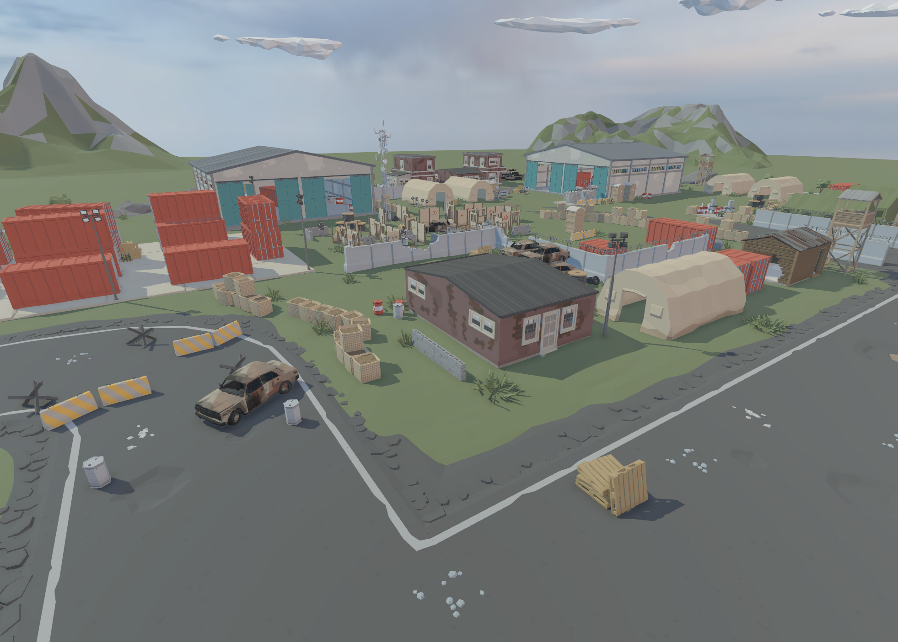

# Rendering

Author: Kirill Bazhenov
Status: Published
Category: Guide
Last edited time: July 21, 2026 10:57 PM
Type: Guideline

# Rendering — System Overview

An index of the rendering subsystems and the design thinking behind them.

## Goals

- **Zero CPU overhead.** All culling on the GPU. No per-instance CPU work.
- **Scales to lower-end hardware.** Minimum spec is the Steam Deck. Mesh shaders need a GTX 1650; a vertex shader fallback is planned for later.
- **Realtime all the time.** No light baking, no overnight precomputation.
- **Stable, clean image.** Motion clarity and stability over extreme fidelity or photorealism. TAA is **strictly** optional — we evaluate image quality without it.
- **Native resolution.** Upscaling is **strictly** optional. Everything is designed to run at native.
- **Technical-artist friendly.** Write custom shaders, modify the lighting code, change parameters at runtime, access command buffers directly.
- **Low latency.** Double buffering by default; triple buffering in build config.

## Architecture

We make a few deliberate bets to hit those goals:

- **GPU-driven.** Instance culling, cluster culling, and indirect draw generation all run in compute.
- **Bindless.** Every shader sees every resource, every resource is a 16-bit handle.
- **Mesh shaders.** No vertex buffers, no input layouts. Geometry arrives as compressed clusters, decompressed one thread per vertex.
- **Strict shader permutation control.** No material graphs, no hidden shader variants.

## Pages

[RHI](Rendering/RHI.md)

[Shaders](Rendering/Shaders.md)

[Meshes](Rendering/Meshes.md)

[Material Rendering Pipeline](Rendering/Material%20Rendering%20Pipeline.md)

[HandleAllocator](Rendering/HandleAllocator.md)

[AppendBuffer](Rendering/AppendBuffer.md)

[ShaderStats](Rendering/ShaderStats.md)
