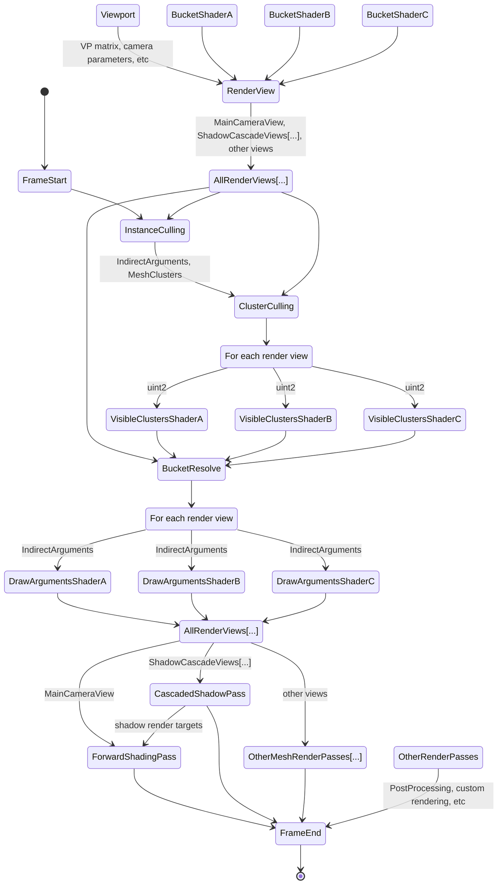
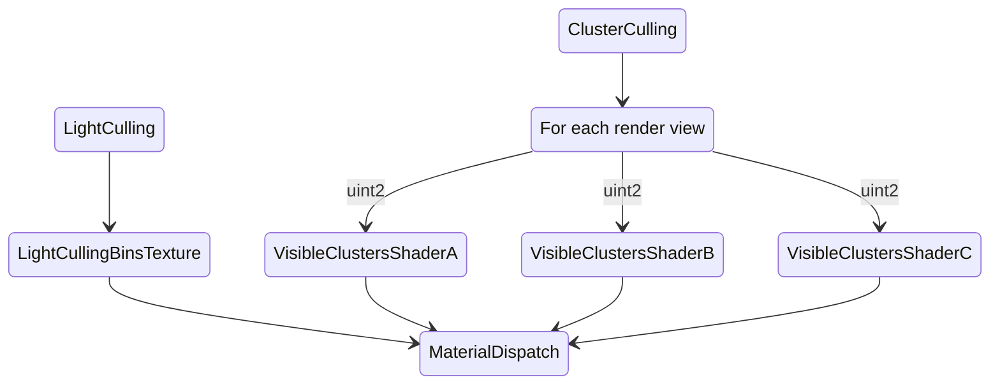

# Material Rendering Pipeline

The material rendering pipeline is a fully GPU-driven path for opaque and transparent triangle meshes. Frustum culling, occlusion culling, cluster culling, and indirect draw argument generation all run in compute shaders — there is no per-instance work on the CPU.

The pipeline produces ready-to-use indirect draw argument buffers for each shader and render view.

## Render Views

We create a render view for the main camera, each shadow cascade, and each reflection probe. Directional lights create 4 render views each for Cascaded Shadow Mapping.

Each view allocates per-shader buffers for visible cluster indices. The cluster culling pass fills these with `uint2` per visible cluster — cluster index and instance index.

## Culling Passes

**Instance culling** is a coarse pass that runs once for all views. If an instance is visible in any view we consider it visible in all views. This pass reduces the cluster count that feeds into cluster culling.

**Cluster culling** runs per-view. It performs frustum and backface culling on each cluster that passed instance culling, followed by fine-grained per-triangle culling on the survivors.

Each visible cluster writes a `uint2` — cluster index and instance index. That is 64 bits per cluster (up to 64 triangles), versus 96 bits per triangle (`uint3` triangle indices) in a traditional compute-based culling approaches.

Because visible clusters are already bucketed per shader, the cluster culling pass can route clusters to different shaders at no extra cost. This enables LOD transition blending and gameplay effects — such as making an area around the player transparent — without CPU involvement or material parameter changes.

## Bucket Resolve

The bucket resolve pass runs after cluster culling. It generates indirect mesh dispatch arguments, batching many clusters into a small number of mesh dispatches.

At the end of the pipeline each render pass receives a ready-to-use draw argument buffer per shader, per render view. Shadow passes do a single depth pass; the forward shading pass runs a depth prepass followed by opaque and alpha blending passes.

## Light and Decal Culling

Lights and decals use tiled screen-space culling. The screen is split into fixed-size tiles (32×32 pixels by default, configurable). A compute shader culls lights per tile and produces a compacted light list. The pixel shader iterates the list with a scalarized bitscan loop.

## Extending the Pipeline

At the moment the renderer is “vertically integrated” — extending it means writing code directly. We are working on a more customizable and data-driven solution, current renderer code is under heavy development.

There is no plugin system or high-level scripting API.

The pipeline has two natural extension points:

1. **Custom mesh rendering passes** inside the material pipeline. Derive from`RenderPass_ForwardShading` or `RenderPass_CascadedShadow` in the engine source. Prefer this when triangle mesh rendering fits into the existing pipeline.
2. **Custom rendering passes** outside the material pipeline. Derive from `RenderPass_PostProcess` in the engine source. Prefer this for image filtering or anything that does not fit the triangle mesh category.

`Renderer_ForwardShading.h/.cpp` implements the clustered forward rendering pipeline. It can be extended or used as a reference for a custom renderer.

Shader authoring is covered in [Shaders](Shaders.md) . Mesh data and compression are in [Meshes](Meshes.md) [.](Meshes.md)