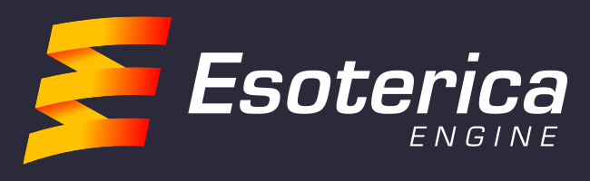
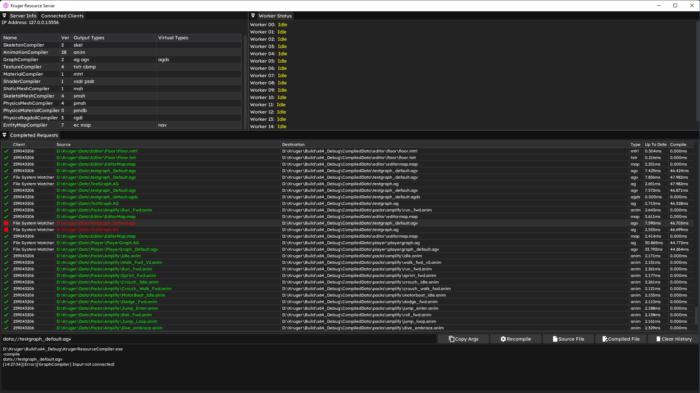
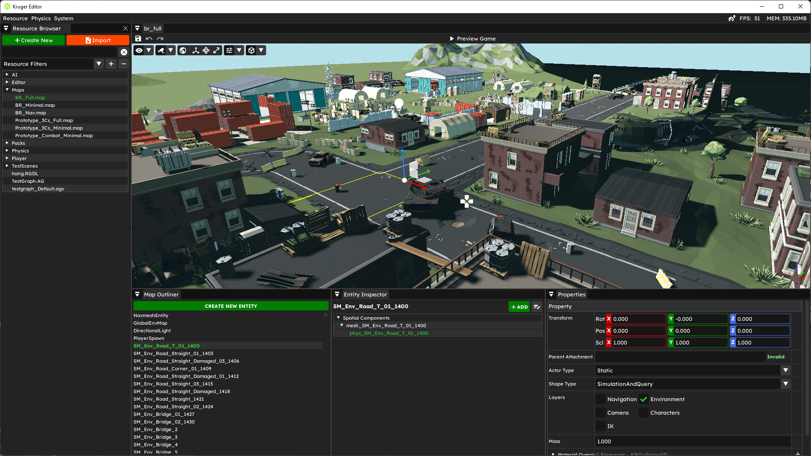
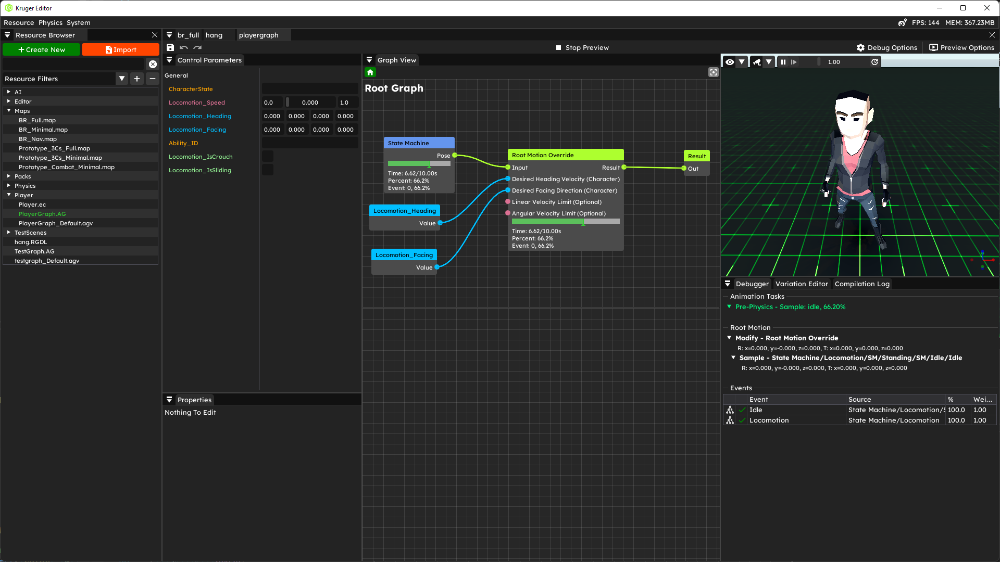
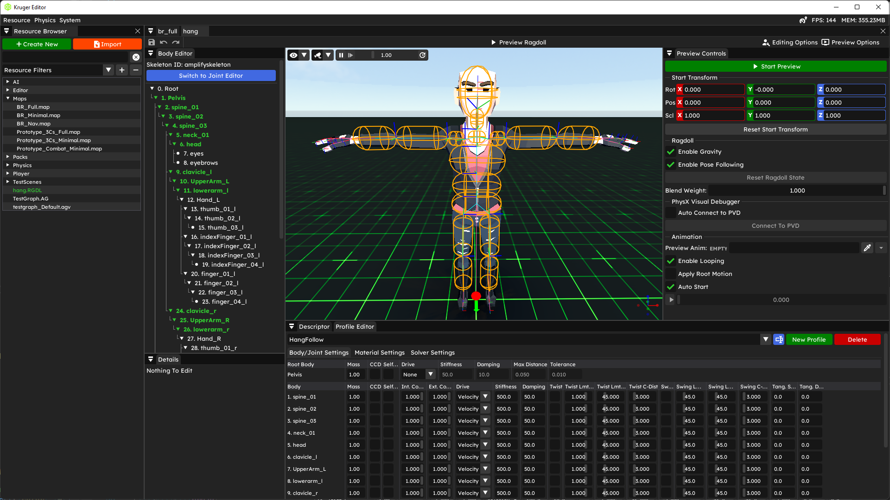

# Esoterica Prototype Game Engine

[Esoterica Engine](https://www.esotericaengine.com) is an MIT licensed prototype game engine framework. It’s intended as a technology demonstrator, an educational tool and an R&D framework. It contains a lot of the boilerplate machinery required for resource management, serialization, gameplay, etc. It provides a lot of references for how to potentially build a resource system, basic reflection and a AAA-level animation system. It could be a good framework for experimenting with game, AI, renderer tech or as a teaching aid for how to build game engines. Additionally, if you are more interested in building your own engine, Esoterica is a really good starting point.

## Important Note: Stability!

>Esoterica is a prototype engine that's being developed in our spare time and as such there will likely be bugs and crashes (primarily with the tooling side). It is not intended as a stable production tool. If you encounter any crashes or bugs, please file issues and we'll try to get to them as soon as we can.

## Help Needed: Rendering + Test Assets

There are no examples of any of the tech supplied unfortunately since we do not have any assets that I can release publically. We are looking for folks that can create some test assets that we can distribute with the engine (e.g., a character model and some animations). We can then use those assets to provide a set of examples of the various tools and features.

We are also looking for a someone to help us build out the renderer. More details can be found here: https://www.esotericaengine.com/contribute

## What's included

* Basic core of a game engine (serialization, math, string handling, logging, etc...)
* Libclang based c++ reflection and code-generation
* Compiler based resource system with hot-reloading
* Hybrid Actor/ECS object model - <https://www.youtube.com/watch?v=jjEsB611kxs>
* AAA quality high performance animation graph system - <https://www.youtube.com/watch?v=R-T3Mk5oDHI&t=5427s>
* Basic animation compression
* Powered Ragdoll implmentation using PhysX articulations
* Basic editor infrastructure and tooling using DearImgui

## Screenshots

|Resource Pipeline | Basic Editor |
|:---:|:---:|
|||

| Animation Graph | Ragdoll Editor |
|:---:|:---:|
|||

## Requirements

* Visual Studio 2022
* FBX SDK

## Building Esoterica

Esoterica uses vanilla msbuild for its build system. There are a set of property sheets that control all the build settings for Esoterica in the "code/property sheets" folder.

1. Download the [external dependencies](https://drive.google.com/file/d/1x0xCUjUimEg6ZAAZPEaOSSU-H0I6jgPU/view?usp=share_link) and extract into the Esoterica root folder (X:/Esoterica Path/). You should end up with 'X:/Esoterica Path/External/'.
2. Download and install the FBX SDK (required for editor) - <https://www.autodesk.com/developer-network/platform-technologies/fbx-sdk-2020-2-1>
3. Open the solution "Esoterica.sln"
4. REBUILD the "Esoterica.Scripts.Reflect" project (under the "0. Scripts" solution folder) - this will generate all the Esoterica reflection data
5. Build the "1. Applications" solution folder - this will build all the applications needed for Esoterica to run.

## Applications

Easiest way to get started, is just set the "Esoterica.Applications.Editor" as the startup project and hit run. If you want to run the engine, use the "Esoterica.Applications.Engine" project with the "-map data://path_to_map.map" argument.

* Engine - this is the standalone Esoterica engine client
* Editor - This is the Esoterica editor
* Resource Server - This is a standalone application that will compile and provide resources to the various Esoterica applications
* Reflector - This generates the Esoterica reflection data
* Resource Compiler - This processes resource compilation requests
* Tester - Empty console app used for random testing

## Thirdparty projects used

* EASTL
* DearImgui
* EnkiTS
* iniparser
* PCG
* xxhash
* rpmalloc
* concurrentqueue
* MPack
* Game Networking Sockets
* PhysX
* cgltf
* pfd
* sqlite
* subprocess
* optick

These middleware packages are also integrated but require a license to use (so they are disabled by default)

* Live++
* Superluminal
* Navpower

## Extra Info

If you use the [SmartCommandLineArguments](https://marketplace.visualstudio.com/items?itemName=MBulli.SmartCommandlineArguments) plugin for VS then there are supplied saved arguments to help you start the engine.
