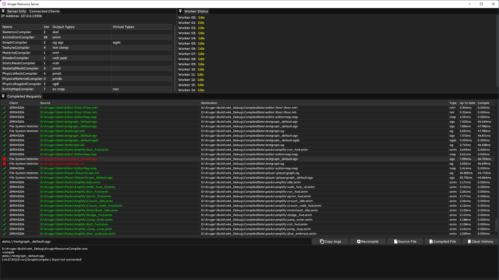
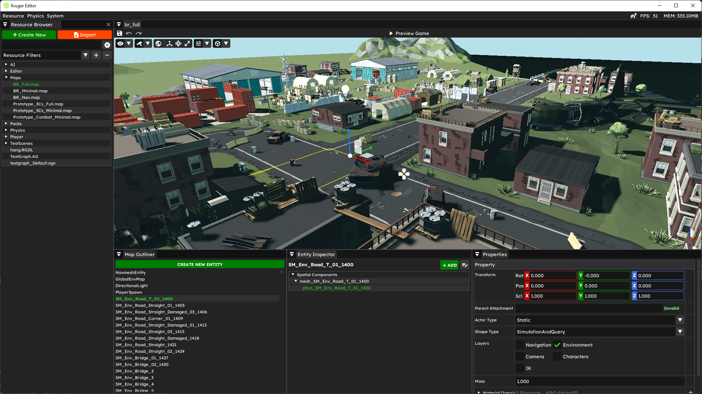
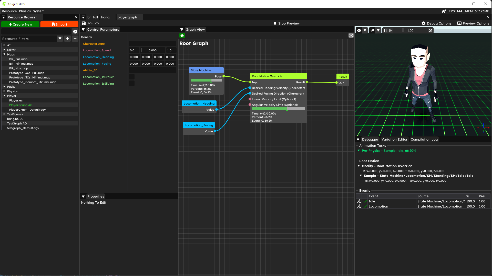
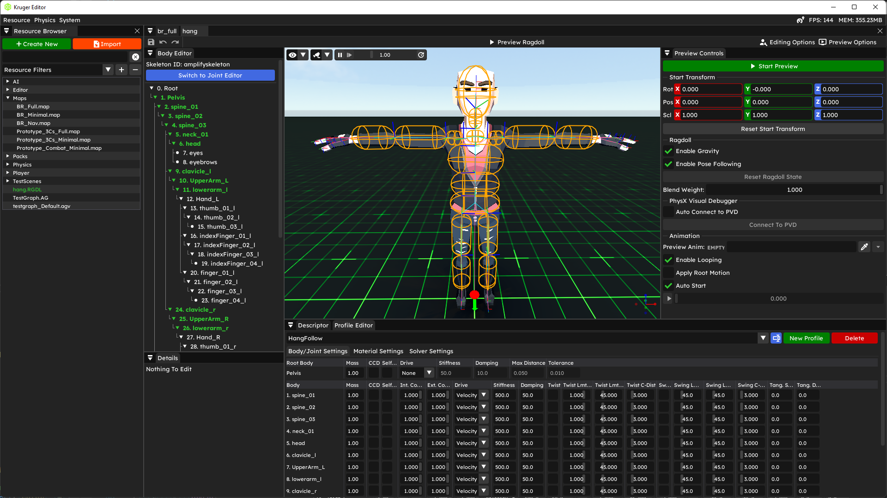

# Kruger Prototype Game Engine

Kruger Game Engine (KRG) is a game engine framework, basically an engine without a renderer. It contains a lot of the boilerplate machinery required for resource management, serialization, gameplay, etc. It provides a lot of references for how to potentially build a resource system, basic reflection and a AAA-level animation system. It could be a good framework for building your own renderer or just to experiment with as most of the tedious/annoying/time consuming pieces are already there.

## Important Note

>Kruger is a prototype engine that I use to mess around with, as such there will be bugs and crashes (primarily with the tooling side). It is meant as a reference or a starter pack not as a production ready tool. Please don't expect me to be actively maintaining it. That said, feel free to flag issues and bugs and I will try to fix them when I have some time.

## Help Needed: Rendering + Examples

There are no examples of any of the tech supplied unfortunately since I do not have any assets that I can release publically. If anyone wants to donate a character model and some animations, I can build and provide examples of the various tools.

If anyone wants to use Kruger to build or experiment with modern rendering, I'd welcome the collaboration. I can provide all the plumbing/engine support needed so you can focus on the pure rendering aspect. It would need to be DX12 though.

## What's included

|Resource Pipeline | Basic Editor |
|:---:|:---:|
|||

| Animation Graph | Ragdoll Editor |
|:---:|:---:|
|||

* Basic core of a game engine (serialization, math, string handling, logging, etc...)
* Libclang based c++ reflection and code-generation
* Compiler based resource system with hot-reloading
* Hybrid Actor/ECS object model - <https://www.youtube.com/watch?v=jjEsB611kxs>
* AAA quality high performance animation graph system - <https://www.youtube.com/watch?v=R-T3Mk5oDHI&t=5427s>
* Basic animation compression
* Powered Ragdoll implmentation using PhysX articulations
* Basic editor infrastructure and tooling using DearImgui

## Requirements

* Visual Studio 2022
* FBX SDK

## Building Kruger

Kruger uses vanilla msbuild for its build system. There are a set of property sheets that control all the build settings for Kruger in the "code/property sheets" folder.

1. Download the external dependencies (<https://drive.google.com/file/d/1whDvXeZKd3P4nbxTmmukPds4SG3saYra/view?usp=sharing>) and extract into the Kruger external folder ( X:/Path/Kruger/External )
2. Download and install the FBX SDK (required for editor) - <https://www.autodesk.com/developer-network/platform-technologies/fbx-sdk-2020-2-1>
3. Open the KRG.sln
4. REBUILD the "KRG.Scripts.Reflect" project - this will generate all the Kruger reflection data
5. Build the "1. Applications" solution folder - this will build all the applications needed for Kruger to run.

## Applications

Easiest way to get started, is just set the "Kruger.Applications.Editor" as the startup project and hit run. If you want to run the engine, use the "Kruger.Applications.Engine" project with the "-map data://path_to_map.map" argument.

* Engine - this is the standalone Kruger engine client
* Editor - This is the Kruger editor
* Resource Server - This is a standalone application that will compile and provide resources to the various Kruger applications
* Reflector - This generates the Kruger reflection data
* Resource Compiler - This processes resource compilation requests
* Tester - Empty console app used for random testing

## Thirdparty projects used

* EASTL
* DearImgui
* EnkiTS
* iniparser
* PCG
* xxhash
* rpmalloc
* concurrentqueue
* MPack
* Game Networking Sockets
* PhysX
* cgltf
* pfd
* sqlite
* subprocess
* optick

These middleware packages are also integrated but require a license to use (so they are disabled by default)

* Live++
* Superluminal
* Navpower

## Extra Info

If you use the SmartCommandLineArguments plugin for VS (<https://marketplace.visualstudio.com/items?itemName=MBulli.SmartCommandlineArguments>) then there are supplied saved arguments to help you start the engine.
