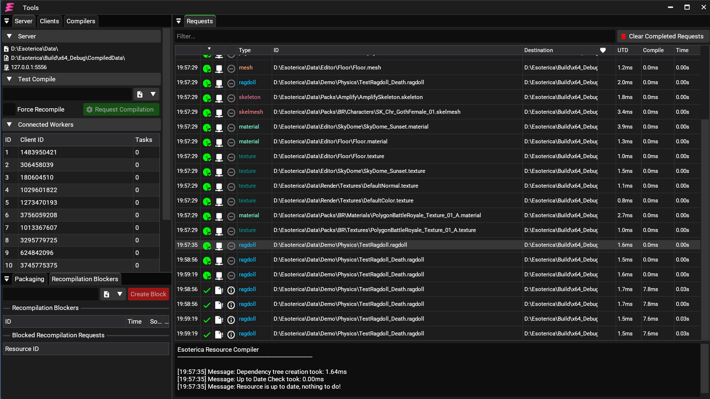
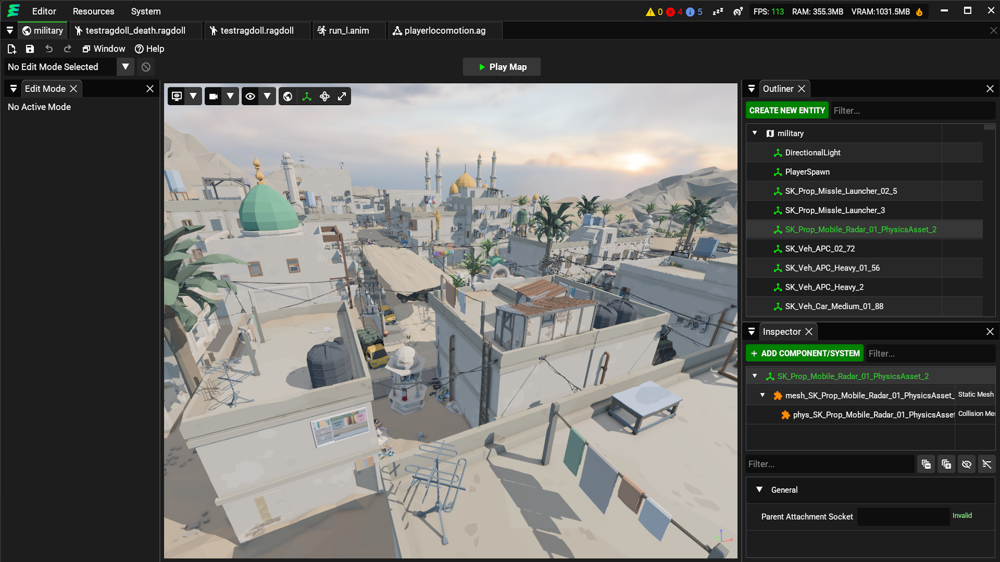
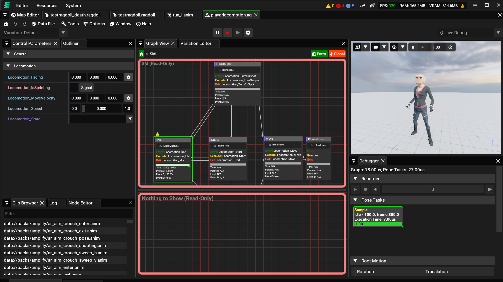
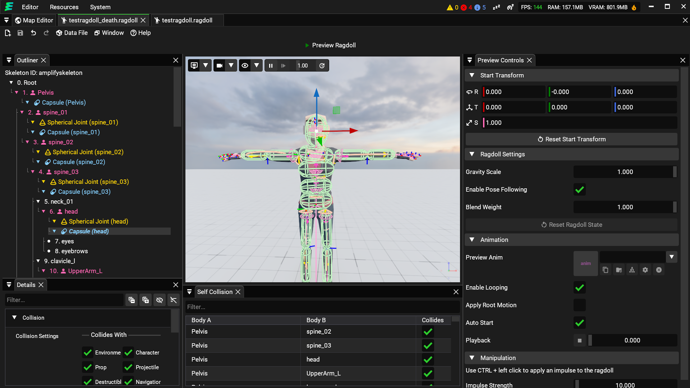

# Esoterica Prototype Game Engine


[Esoterica Engine](https://www.esotericaengine.com) is an MIT licensed prototype game engine framework. It’s intended for use either as a proprietary engine starter pack, a technology demonstrator, an educational tool or an R&D framework. The goal of Esoterica is to provide a solid and robust starting point for folks that are looking to build their own tech or transition off of existing tech. It provides a lot of the boring and time consuming boilerplate systems (reflection, serialization, resource management, math, etc...) as well as a tool framework allowing people to rapidly build their own tool/editors.

We need to be clear that Esoterica is NOT an off the shelf game engine that you can just take and work with. It is intended for technical teams that have the ability to extend and build upon it.

## Important Note: Stability

>Esoterica is a prototype engine that's being developed in our spare time and as such there will likely be bugs and crashes (primarily with the tooling side). It is not intended as a stable production tool. If you encounter any crashes or bugs, please file issues and we'll try to get to them as soon as we can.

## Open Source Not Open Contribution

Esoterica is not a product and so there wont be any formal releases or versions. As such, we are not looking for any feature requests, nor are we looking for large PR contributions. Any feature requests or large PR will be rejected. That said, please feel free to create issues for bugs, clearly broken/incomplete pieces of code or for general questions.

## Documentation

As Esoterica is constantly being iterated and worked upon, it becomes hard to provide any documentation that isnt immediately out of date. Additionally, it becomes even less relevant for people forking it to build their own engine with. The code itself is heavily commented and written to be as readable as possible, this is how we intended to provide documentation moving forward.

We do have highlevel docs for the renderer here: <https://docs.esotericaengine.com>

And we have several presentations that cover the high level decisions regarding the entity model and the animation systems here: <https://www.esotericaengine.com/docs>

## Help Needed: Sample Game

If really you do wish to contribute, we do need some help. We are looking for folks to help us build out a simple sample game that we can include with the project. 

We are looking for the following: 

* *A technical animator* to build out a locomotion and combat anim set.
* *A technical character artist* to build out some test characters, as well as help define the character tech pipelines (deformation, cloth, procedural bones).

More details can be found here: <https://www.esotericaengine.com/contribute>

## What's included

* Basic core of a game engine (serialization, math, string handling, logging, etc...)
* Libclang based c++ reflection and code-generation
* Compiler based resource system with hot-reloading
* Modern bindless DX12 renderer - <https://docs.esotericaengine.com>
* Hybrid Actor/ECS object model - <https://www.youtube.com/watch?v=jjEsB611kxs>
* AAA quality high performance animation system - <https://www.youtube.com/watch?v=R-T3Mk5oDHI&t=5427s> - Used in multiple shipped games.
* Box3D integration and basic ragdoll tooling
* Basic editor infrastructure and tooling using DearImgui

## Screenshots

|                      Resource Pipeline                       |                Basic Editor                 |
|:------------------------------------------------------------:|:-------------------------------------------:|
|  |  |

|                     Animation Graph                     |                Ragdoll Editor                 |
|:-------------------------------------------------------:|:---------------------------------------------:|
|  |  |

## Requirements

* Visual Studio 2026 (18.6.1+)

## Building Esoterica

Esoterica uses vanilla msbuild for its build system. There are a set of property sheets that control all the build settings for Esoterica in the "code/property sheets" folder.

1. Get the external dependencies set up: there are two ways to do this:

    * Run the ```DownloadDependencies.bat``` script found in the root folder
    * Manually download the [external dependencies](https://data.esotericaengine.com/ExternalData.zip) archive and extract into the Esoterica root folder (X:/Esoterica Path/). You should end up with 'X:/Esoterica Path/External/'

1. Open the solution "Esoterica.sln"
1. Manually rebuild the "Esoterica.Scripts.Reflect" project (under the "0. Scripts" solution folder) - this will generate all the required Esoterica reflection code needed for the project to compile.
1. Build the solution

## Applications

Easiest way to get started, is just set the "Esoterica.Applications.Editor" as the startup project and hit run. If you want to run the engine, use the "Esoterica.Applications.Engine" project with the "-map data://path_to_map.map" argument.

* Engine - this is the standalone Esoterica engine client
* Editor - This is the Esoterica editor
* Resource Server - This is a standalone application that will compile and provide resources to the various Esoterica applications
* Reflector - This generates the Esoterica reflection data
* Resource Compiler - This processes resource compilation requests
* Tester - Empty console app used for random testing

## Thirdparty projects used

* EASTL
* DearImgui
* EnkiTS
* iniparser
* PCG
* rapidhash
* rpmalloc
* concurrentqueue
* MPack
* Game Networking Sockets
* ixwebsocket
* Box3D
* ufbx
* cgltf
* pfd
* sqlite
* subprocess
* optick
* meshoptimizer
* ctt
* D3D12MemoryAllocator
* STB
* LZAV
* pugixml
* rapidhash
* delabella
* tinyexr
* Freetype
* LLVM
* SMAA
* TonyMcMapFace
* GTAO

These middleware packages are also integrated but require a license to use (so they are disabled by default)

* Live++
* Superluminal
* Navpower

## Extra Info

If you use the [SmartCommandLineArguments](https://marketplace.visualstudio.com/items?itemName=MBulli.SmartCommandlineArguments) plugin for VS then there are supplied saved arguments to help you start the engine.
